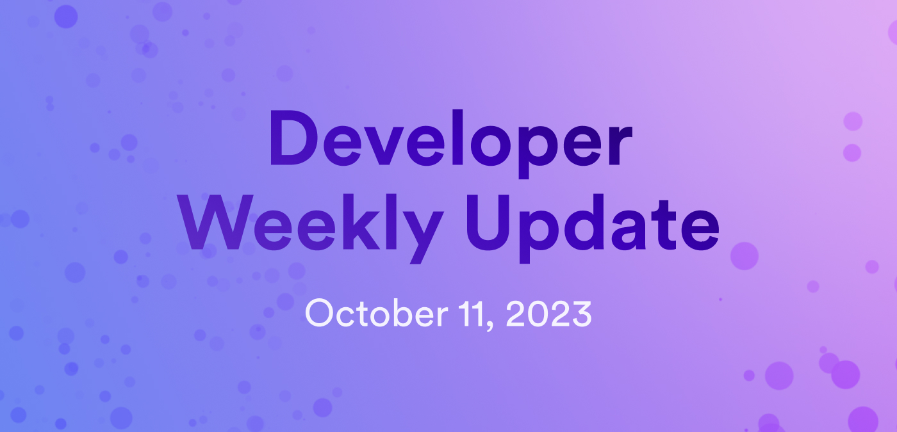

# Developer weekly update October 11, 2023

Hello everyone and welcome to DFINITY developer weekly! This week, we'll talk about updates to ckBTC, the `ic-js` library, and increased subnet storage and resource reservation. Let's dive in! 

## ckBTC now supports ICRC-2 standards 

The ledger, index, and archive canisters for ckBTC have been upgraded to now support the ICRC-2 standard! As part of this upgrade, the ckBTC minter has also been upgraded to support a simpler flow for transferring ckBTC into BTC. In this new minter workflow, the minter can be authorized to take ckBTC and use it to obtain BTC using the new `retrieve_btc_with_approval` endpoint instead of sending ckBTC to a minter-controlled subaccount.

You can read the full details on the DFINITY [forum](https://forum.dfinity.org/t/ckbtc-a-canister-issued-bitcoin-twin-token-on-the-ic-1-1-backed-by-btc/17606/166).

## Ledger ICP/ICRC breaking changes 

Recently, the `ic-js` library has undergone breaking changes. Part of these changes include relocating ICP ledger features previously included in the package `@dfinity/nns` to `@dfinity/ledger-icp` and moving the ICRC ledger features to `@dfinity/ledger-icrc`. The `@dfinity-ledger` package will be deprecated and retired in the future.

Essentially, as a result of these changes, the `@dfinity/ledger-icp` package encompasses the ICP ledger functions, and the `@dfinity/ledger-icrc` package encompasses functions for ICRC tokens, ckBTC, and SNSs.  

The full details can be found on the forum [here](https://forum.dfinity.org/t/breaking-changes-in-ledger-icrc-icp-javascript-libraries/23465?utm_source=weekininternetcomputer.beehiiv.com&utm_medium=referral&utm_campaign=week-in-internet-computer-icp-news-oct-7-2023).

## Increased subnet storage capacity and resource reservation 

The subnet storage capacity has been increased from 450GiB to 700GiB as of replica version `76fd768b`. This increase is the first significant milestone in the movement to push the subnet storage capacity toward terabytes rather than gigabytes. 

In addition to this storage increase, a new resource reservation mechanism is designed to enable consistent, long-term use of storage for nodes running on application subnets by making it more expensive for inconsistent, high spikes of usage, and keeping costs the same for consistent, long-term users. This is because system subnets and verified application subnets do not need protection from sudden, unexpected, large spikes in storage usage.

This new mechanism has been added to `dfx` through the new fields `reserved_cycles` and `reserved_cycles_limits`. Check out this [forum post](https://forum.dfinity.org/t/increasing-subnet-storage-capacity-and-introducing-resource-reservation-mechanism/23447) for the full information and how these changes work. 

That'll wrap it up for this week, until next time!

-DFINITY