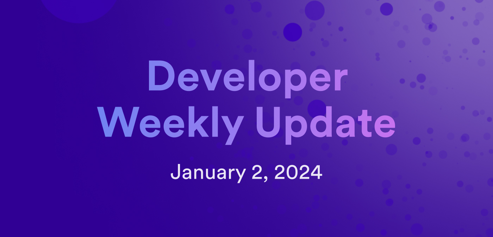

# Developer weekly update January 2, 2024

Hello developers and happy New Year! To kick off the year, let's explore some of the upcoming features and tools that developers can look forward to in 2024!

## `dfx new` updates

`dfx new` is a core command used by developers to create a new project that by default uses a 'Hello, world!' template. Currently, this command doesn't support the ability to choose a different project template, CDK, or frontend canister framework. To offer a richer workflow for bootstrapping new projects, the `dfx new` command will be updated and reworked to enhance the developer experience. Part of this update will include the ability to choose between different project templates, languages, and frontend frameworks when creating a new project. 

## Version manager for dfx

When developers want to use different versions of dfx, the current workflow to switch between them can be tedious and time consuming. To make this process easier, a new dfx version manager tool is currently under development. The tool, known as `dfxvm` will provide developers the ability to install and manage different versions of dfx seamlessly. It will also pave the way for supporting package manager installs of dfx in the future. 

## Cycles ledger

To enhance and improve cycles management across projects, the upcoming cycles ledger will replace the current cycles wallet workflow. The current cycles wallet workflow is a common pain point for new developers, since it requires significant prerequisite knowledge to be used effectively. Once the cycles ledger has been released, dfx will use this new cycles ledger to simplify the cycles management workflow for developers deploying their dapps to the mainnet. The cycles wallet will still be maintained and available for developers to use instead, however. 

## Canister logging

An important enhancement for canister debugging is on the way: logging for canisters deployed on the mainnet. This logging feature will support storing and retrieving logs to get detailed insights into the behavior of a project's canisters. Logging will support both the canister and replica level information depending on the preferred detail level.

## Streaming support

To support video hosting and streaming dapps, the asset canister will soon support streaming through content-range requests. For example, this support will include the ability for the HTML <video> tag to be used and the ability to seek or scrub the video playback. This will help pave the way for more types of applications to be deployed on ICP. 

## Rust developer journey tutorial series

To further build upon the ICP [developer journey tutorial series](/docs/current/tutorials/developer-journey/), a new variation will be released this year in 2024 that focuses on Rust development rather than Motoko development. A Rust version has been highly requested by the ICP developer community, and we're excited to provide more resources for Rust development on ICP. 

## Documentation additions

In addition to a Rust variation of the developer journey, there are several other additions planned for the developer documentation, such as:

- Quick start guides for Python, TypeScript, C++, Solidity, and other languages to help onboard developers of all backgrounds. 

- Guides for Ethereum development on ICP, showcasing the upcoming EVM RPC canister and Ethereum integration. 

- Updates and additions to the Motoko documentation.

- New tutorials, guides, and code examples. 

We hope you're all as excited for this year as we are! That'll wrap up this week's developer weekly update, be sure to tune in next week!

-DFINITY