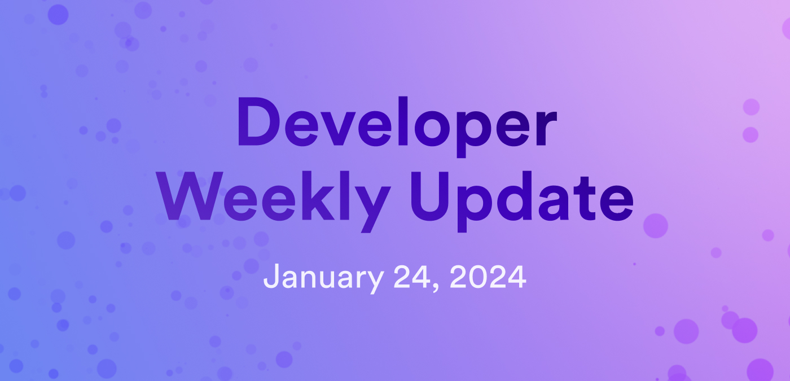

# Developer weekly update January 24, 2024

Hello developers, and welcome to this week's developer weekly update! This week, we'll talk about a new version of agent-js, a new developer documentation series, and an important update to the replica. Let's get started! 

## Agent-JS v 0.21.2

This week a new version of agent-js has been released! In this release there are several new features such as:

- Introducing `PartialIdentity` export, allowing you to use @dfinity/identity in @dfinity/auth-client and delegate any public key without the full key pair in the agent.

- Replacing the `secp256k1` npm package with `@noble/curves`.

- `github.dev` and `gitpod.io` have been added as known hosts.

This release also includes several bug fixes, such as:

- Fix for running audit. 

- Horning the `disableIdle` flag.

- Limiting the delegation depth of `read_state` certificates to 1.

For more information, read the [full release notes](https://github.com/dfinity/agent-js/releases/tag/v0.21.2).

## Hackathon prep course series

A new tutorial series has been published in the dev docs! This series is designed to act as preparatory materials for hackathon participants, giving them a crash-course style to developing on ICP and kickstart their hackathon projects!

This series contains the modules:

- [1: What is the Internet Computer?](/docs/current/tutorials/hackathon-prep-course/what-is-icp).

- [2: Deploying your first fullstack dapp](/docs/current/tutorials/hackathon-prep-course/deploying-first-fullstack-dapp).

- [3: Exploring the backend](/docs/current/tutorials/hackathon-prep-course/exploring-the-backend).

- [4: Exploring the frontend](/docs/current/tutorials/hackathon-prep-course/exploring-the-frontend).

- [5: Integrating with tokens](/docs/current/tutorials/hackathon-prep-course/integrating-with-tokens).

- [6: Authentication](/docs/current/tutorials/hackathon-prep-course/authentication).

- [7: Obtaining cycles](/docs/current/tutorials/hackathon-prep-course/obtaining-cycles).

- [8: Managing canisters](/docs/current/tutorials/hackathon-prep-course/managing-canisters).

- [9: Sample starter projects](/docs/current/tutorials/hackathon-prep-course/sample-starter-projects).

- [10: Resources to learn more](/docs/current/tutorials/hackathon-prep-course/resources).

## Latest replica version

The latest version of the IC replica contains an important update that enables P2P implementation for tECDSA and HTTPS outcalls! The following technological improvements are included in this update:

- Replicas are guaranteed not to crash due to unbounded memory growth. 

- Congestion control is fair, meaning that messages from one peer should not be favored over messages from another.

- No head-of-line blocking delays.

- Replication latency has been reduced by pushing small artifacts less than 1KB. 

This update lays the groundwork for future improvements to the finalization rate of the consensus protocol, meaning faster interaction with dapps.

That'll wrap up this week. Tune back in next week for more developer updates!

-DFINITY
