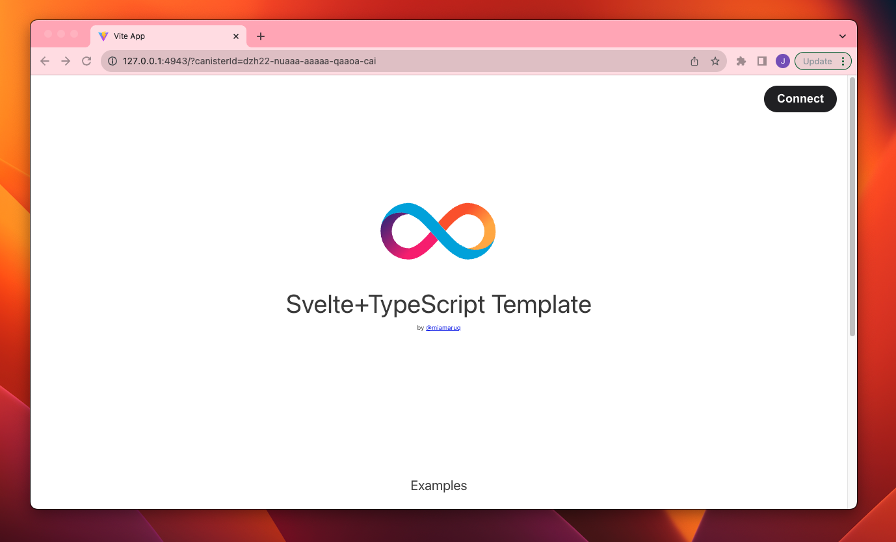

# Svelte frontend example

## Overview

Svelte is a JavaScript web application framework that can be used to develop and deploy a frontend canister on the Internet Computer. 

A community-developed project can be used to create a boilerplate template for apps using React and Typescript or Javascript. 

:::info
In the future, the `dfx new` command will include the ability to select between frontend templates for React, Vue, and other frameworks when creating a new project. 
:::


## Prerequisites

Before you start your project, verify the following:

- [x] Download and install the IC SDK package as described in the [installing the IC SDK](/docs/current/developer-docs/setup/install/index.mdx) page.

- [x] Download and install [git](https://git-scm.com/downloads).

- [x] Download and install [node.js](https://nodejs.org/en).

### Step 1: Clone the project repository.

```
git clone https://github.com/MioQuispe/create-ic-app.git
```

### Step 2: Create a new app with the command:

```
npx create-ic-app@latest
```

This command will prompt you to provide a project name, then choose a project template. Choose 'Svelte'.


Then, select either 'JavaScript' or 'Typescript' depending on which language you'd like to use.


This will create a project using a simple Svelte frontend template and a simple Motoko actor that defines a `counter` method. 

### Step 3: Once your project has been created, navigate into the project's directory:

```
cd ic-dapp
```

Install the project's dependency packages with the command:

```
npm install
```

### Step 4: Generate Candid definitions.

Next, generate the Candid definition for the backend canister with the command:

```
dfx generate
```

Then, copy the generated files into the `.dfx/local` directory:

```
cp src/declarations/counter/* .dfx/local/canisters/counter/
```

### Step 5: Edit the `dfx.json` file.

Edit the `networks` portion of the `dfx.json` file to reflect using port `4943`:

```json
...
  "networks": {
    "local": {
      "bind": "127.0.0.1:4943",
      "type": "ephemeral"
    },
...
```

### Step 6: Deploy the project:

```
dfx deploy
```

### Step 7: Start the local development server for the frontend:

```
npm run dev
```

### Step 8: Navigate to the frontend canister to view the Svelte frontend.

Navigate to the frontend canister using the URL `http://127.0.0.1:4943/?canisterId=<canister-id>`, such as:

```
http://127.0.0.1:4943/?canisterId=cbopz-duaaa-aaaaa-qaaka-cai
```

The default Svelte UI will be displayed.



This frontend is using the file stored at `./dist/index.html`, and the corresponding frontend scripts and assets are stored at `./frontend/`. 