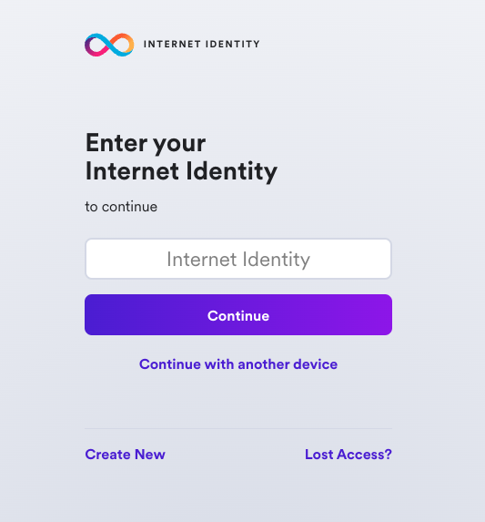
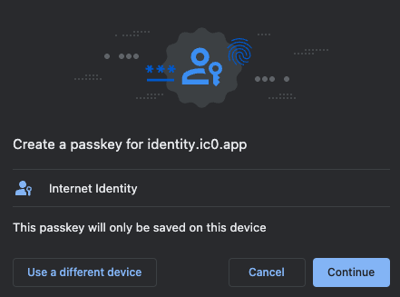

# Internet Identity integration

## Overview
This guide shows an example of how to integrate Internet Identity into an application by using a simple 'Who am I?' backend canister and a frontend UI that returns the Internet Identity principal of the user who calls the backend's `whoami` method. 

This project uses the **pullable** version of the Internet identity canister. A pullable canister is a canister that provides a public service at a static canister ID. To learn more about pullable canisters, please see the documentation [here](/docs/current/developer-docs/setup/pulling-canister-dependencies). 

### Prerequisites

Before you start, verify that you have:

- Downloaded and installed [`dfx`](https://github.com/dfinity/sdk/releases/latest) version 0.14.1 or later.
- [Node.js v16+.](https://nodejs.org/en).

### Step 1: To get started, open a terminal window and create a new project:

```
dfx start --clean --background
dfx new ii_integration
```

### Step 2: For this project, we'll use a simple 'Who am I?' function for the backend canister. Open the `src/ii_integration_backend/main.mo` file and replace the existing content with the following:

```motoko
actor {
    public shared (msg) func whoami() : async Principal {
        msg.caller
    };
};
```

In this actor, there is a single method that responds with the caller's principal. This will show if we make a request from the application's frontend using an authenticated Internet Identity or an AnonymousIdentity. 

### Step 3: Next, open the `dfx.json` file and replace the existing content with the following:


```json
{
  "canisters": {
    "ii_integration_backend": {
      "main": "src/ii_integration_backend/main.mo",
      "type": "motoko"
    },
    "internet_identity" : {
      "type": "pull",
      "id": "rdmx6-jaaaa-aaaaa-aaadq-cai"
    },
    "ii_integration_frontend": {
      "dependencies": [
        "ii_integration_backend"
      ],
      "frontend": {
        "entrypoint": "src/ii_integration_frontend/src/index.html"
      },
      "source": [
        "src/ii_integration_frontend/assets",
        "dist/ii_integration_frontend/"
      ],
      "type": "assets"
    }
  },
  "defaults": {
    "build": {
      "args": "",
      "packtool": ""
    }
  },
  "output_env_file": ".env",
  "version": 1
}
```

As mentioned in the introduction, we'll be using the **pullable** version of the Internet Identity canister, which uses the `dfx deps` workflow. The project's `dfx.json` file defines the Internet Identity canister as `"type": "pull"`. 

### Step 4: Pull the II canister using `dfx deps`:

```
dfx deps pull
```

### Step 5: Initialize the canister. 

We can use the `'(null)'` value passed to the init command to use the default values. To do so, run the command:

```
dfx deps init internet_identity --argument '(null)'
```

### Step 6: Install the @dfinity/auth-client package:

```
npm install @dfinity/auth-client
```

### Step 7: Insert the following code into the `src/ii_integration_frontend/src/index.js` file:

```
import {
    createActor,
    ii_integration_backend,
} from "../../declarations/ii_integration_backend";
import { AuthClient } from "@dfinity/auth-client";
import { HttpAgent, Actor } from "@dfinity/agent";

let actor = ii_integration_backend;

console.log(process.env.CANISTER_ID_INTERNET_IDENTITY);

const greetButton = document.getElementById("greet");
greetButton.onclick = async (e) => {
    e.preventDefault();

    greetButton.setAttribute("disabled", true);

    const greeting = await actor.greet(
        (await Actor.agentOf(actor).getPrincipal()).toString()
    );

    greetButton.removeAttribute("disabled");

    document.getElementById("greeting").innerText = greeting;

    return false;
};

const loginButton = document.getElementById("login");
loginButton.onclick = async (e) => {
    e.preventDefault();

    let authClient = await AuthClient.create();

    // start the login process and wait for it to finish
    await new Promise((resolve) => {
        authClient.login({
            identityProvider:
                process.env.DFX_NETWORK === "ic"
                    ? "https://identity.ic0.app"
                    : `http://localhost:4943/?canisterId=rdmx6-jaaaa-aaaaa-aaadq-cai`,
            onSuccess: resolve,
        });
    });

    const identity = authClient.getIdentity();
    const agent = new HttpAgent({ identity });
    actor = createActor(process.env.CANISTER_ID_II_INTEGRATION_BACKEND, {
        agent,
    });

    return false;
};
```

This code does the following:

- Interacts with the backend actor to call the `greet` method.
- Creates an `auth` client.
- Retrieves the Internet Identity from the `auth` client.
- Uses the Internet Identity to create an agent that interacts with the IC.
- Then, uses the interface description of the app to create an actor that's used to call the app's service methods.

### Step 8: Insert the following code into the `src/ii_integration_frontend/src/index.html` file:

:::info 
If you used a project name other than `ii_integration`, you will need to rename the inputs in the code.
:::

```html
<!DOCTYPE html>
<html lang="en">
  <head>
    <meta charset="UTF-8" />
    <meta name="viewport" content="width=device-width" />
    <title>greet</title>
    <base href="/" />
    <link rel="icon" href="favicon.ico" />
    <link type="text/css" rel="stylesheet" href="main.css" />
  </head>
  <body>
    <main>
      
      <br />
      <br />
      <form>
        <button id="login">Login!</button>
      </form>
      <br />
      <form>
        <button id="greet">Click Me!</button>
      </form>
      <section id="greeting"></section>
    </main>
  </body>
</html>
```

This code provides a simple UI for us to interact with our application. 

:::info 
If you'd rather clone the repo for this code, it can be found [here](https://github.com/letmejustputthishere/ii_integration_example). 
:::

### Step 9: Deploy the project:

```
dfx deps deploy
dfx deploy
```

### Step 8: Navigate to the frontend canister's URL in your web browser. You will see the frontend of the app:


### Step 9: Then, select 'Log in'. 

You'll be redirected to the II frontend. Since we're running this locally, this will be using a local, non-production Internet Identity. To create one, follow the on-screen steps.

### Step 10: Create a local Internet Identity

- Select 'Create New' from the UI.



- Next, select 'Create Passkey'.


- When prompted, choose how to create your passkey, either on your current device or you can use another device. 



- Then, enter the CAPTCHA to continue.


Your Internet Identity has been created! It'll be shown on the screen, and it is recommended that you write it down in a safe location to save it. 

This number is your Internet Identity. With this number and your passkey, you will be able to create and securely connect to Internet Computer dapps. If you lose this number, you will lose any accounts that were created with it. This number is not secret, but is unique to you.

Once you save it, select the 'I saved it, continue' button.

### Step 11: Once you are redirected back to the frontend of the app, click the 'Click me!' button.

### Step 12: Your Internet Identity's principal ID will be returned:


## Resources

- [Internet Identity dashboard](https://identity.ic0.app/).
- [Internet Identity specification](https://internetcomputer.org/docs/current/references/ii-spec).
- [Internet Identity GitHub repository](https://github.com/dfinity/internet-identity).
- [Internet Identity alternative frontend origins](https://internetcomputer.org/docs/current/developer-docs/integrations/internet-identity/alternative-origins).
- [Internet Identity integration](https://internetcomputer.org/docs/current/developer-docs/integrations/internet-identity/integrate-identity).
