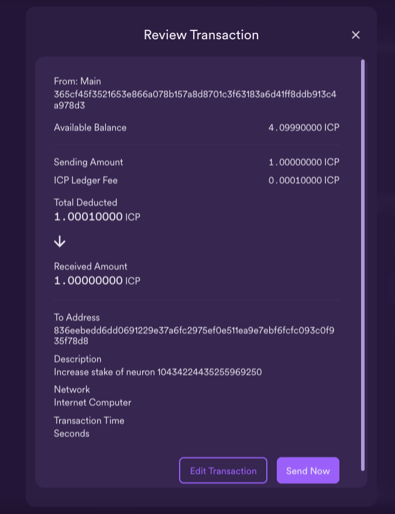
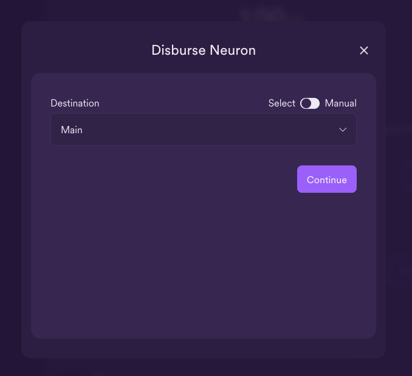
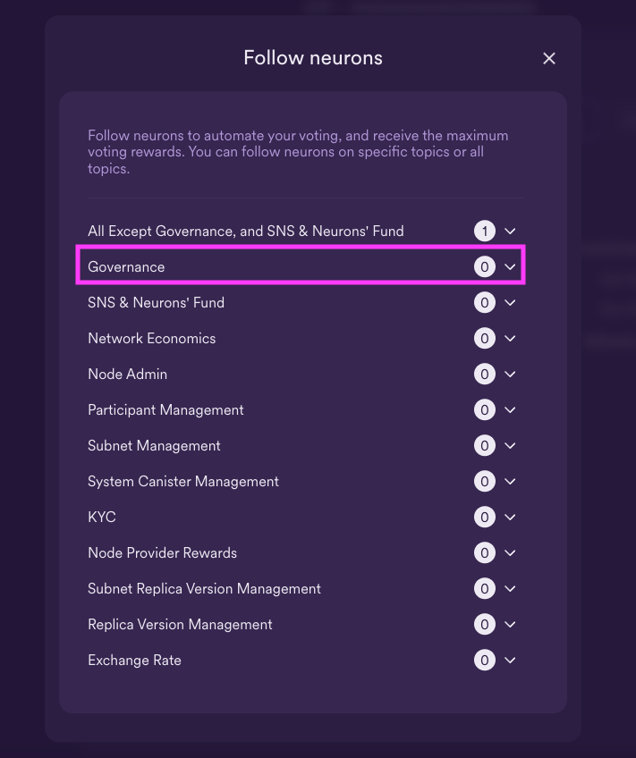
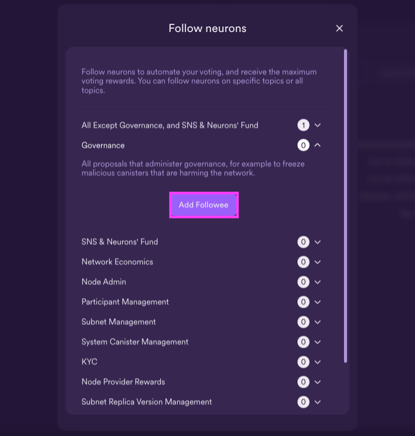
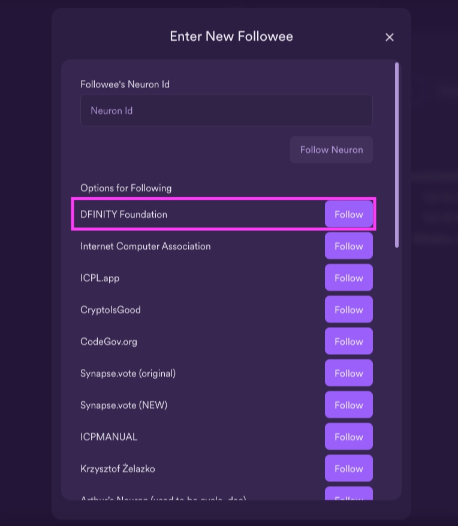
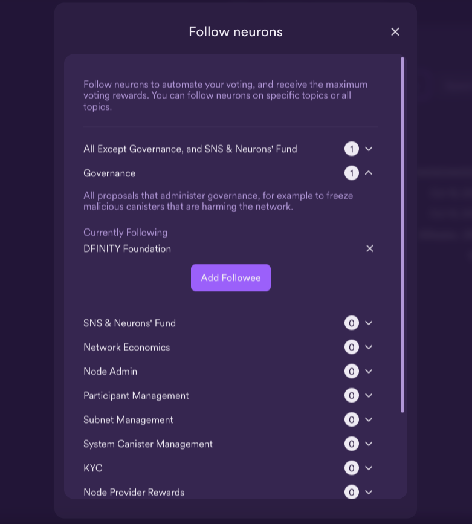
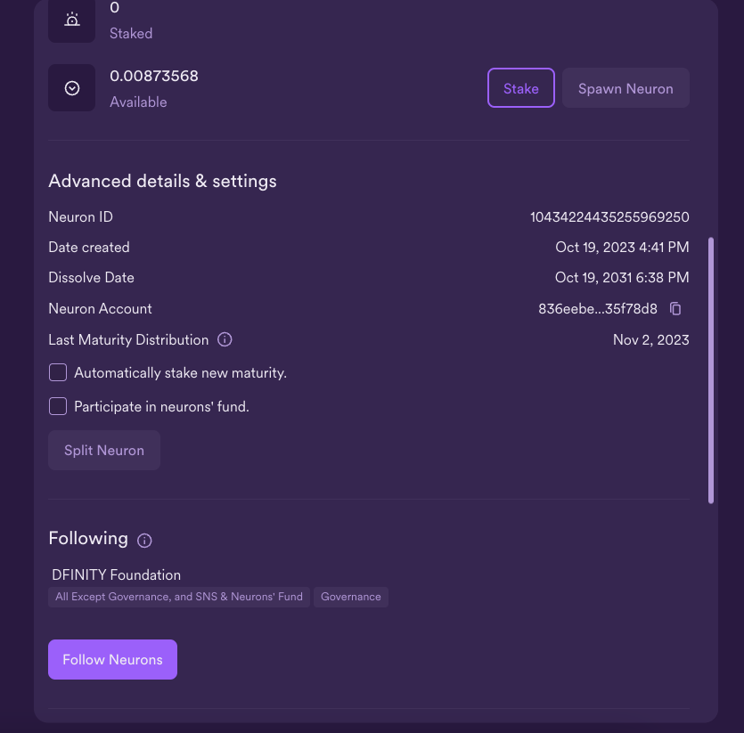

# Network Nervous System (NNS) dapp quick start 

## Overview
All changes to the configuration and behavior of the Internet Computer are controlled by an algorithmic governance system called the Network Nervous System (NNS). The NNS controls all aspects of the Internet Computer blockchain configuration and is responsible for performing many network management operations. For example, the Network Nervous System (NNS) is responsible for:

-   Upgrading the protocol and guest operating system software used by the nodes that provide computing capacity to the network.
-   Inducting new node operators and machines into the network.
-   Creating new subnets to increase network capacity.
-   Splitting subnets to balance network load.
-   Configuring parameters that control how much must be paid by users for compute capacity.
-   Monitoring canister activity and node performance for malicious behavior and statistical deviations.
-   De-activating malicious software or under-performing nodes to protect the network.

The requests for changes and updates to the network are submitted to the NNS in the form of **proposals**. The NNS decides to adopt or reject proposals based on voting activity by neuron holders.

## What are neurons?

For network participants to be able to vote on proposals, they need to lock up a stake of ICP utility tokens for a given period of time to create a representative called a **neuron**.

Because neurons represent a stake of ICP utility tokens, they also represent an identity with a **ledger canister account** and a principal that controls the ledger account.

Neurons provide the stability required for responsible governance of the Internet Computer by ensuring that the ICP utility tokens they represent cannot be exchanged for a specific period of time referred to as the **lock-up** period.

The following diagram provides a simplified view of the workflow for creating a neuron and the relationship between the neuron and ledger canisters.


### Governance and voting rewards

When a person or organization has ICP utility tokens locked up in a neuron, the neuron holder can propose and vote on governance issues. To encourage participation, neuron holders are also rewarded for voting in proportion to the number of ICP utility tokens they have locked up and the length of the lock-up period up to a maximum of eight years.

### Unlocking the stake held by a neuron

After network participants create a neuron, the locked balance of ICP utility tokens can only be unlocked by fully **dissolving** the neuron. In its **locked** state, the neuron has a fixed non-zero **dissolve delay** equivalent to the lock-up period. For example, assume you have a stake of 100 ICP utility tokens locked up for a period of five years. After successfully created the neuron with these settings, your dissolve delay is five years.

Based on the dissolve delay that decreases as time progresses, a **dissolve timer** determines how long it will take to completely dissolve a neuron.

When the dissolve timer reaches zero, the neuron owner—the ICP utility token holder who created the neuron, or an authenticated custodian, can dissolve the neuron and unlock the balance of ICP utility tokens.

The dissolved neuron ceases to exist and the stake of ICP utility tokens that the neuron represented is released to the appropriate ledger canister account.

## Connect to the Internet Computer

To connect to the Internet Computer using the Network Nervous System (NNS) dapp:

- #### Step 1:  Open a browser and navigate to the [Network Nervous System (NNS)](https://nns.ic0.app) dapp.


- #### Step 2:  Click **Login** to connect to [Internet Identity](https://identity.ic0.app).


If you haven’t previously registered, you can click **Register with Internet Identity** to register.

:::info
We strongly recommend you add multiple devices and authentication methods to your Internet Identity. For example, register multiple physical devices like your computer and phone with a security key and using the authentication options that those devices—and browsers running on them—support.
:::

For more information about creating an Internet Identity, see [how to use Internet Identity](https://internetidentity.zendesk.com/hc/en-us/articles/15430677359124-How-Do-I-Create-an-Internet-Identity-on-My-Mobile-Device-).

After you have registered, you can click **Login** to authenticate using your anchor and the authentication method—for example, a security key or fingerprint—you have registered.

- #### Step 3:  Click **Proceed** to access to the Network Nervous System (NNS) dapp.

### Add an account

Logging on using an Internet Identity creates a main account for you in the Internet Computer ledger. If your ICP utility tokens are associated with your developer identity; that is, the identity created by the SDK `dfx` command-line interface. Your main account displays 0.00 for your ICP utility token balance. For example:


Before transferring any tokens, you can create one or more linked subaccounts or attach a hardware wallet to your account.

To add an account for managing ICP utility tokens:

- #### Step 1:  On the default 'My Tokens' tab, click **Add Account**.


- #### Step 2:  Select the type of account to add.

    -   **New Linked Account** creates a new subaccount linked to your Main account address in the ledger.

    -   **Attach Hardware Wallet** adds a hardware wallet to your main account address in the ledger.


- #### Step 3:  Click **New Linked Account**, type an Account Name, then click **Create**.


## Transfer ICP utility tokens between accounts

### Using the CLI

If you have selected self-custody for holding your ICP utility tokens and the tokens are associated with your developer identity instead of your registered Internet Identity, you need to transfer ICP utility tokens to your accounts if you want to manage them using the [Network Nervous System (NNS)](https://nns.ic0.app) dapp.

To transfer ICP utility tokens controlled by your developer identity:

- #### Step 1:  Open a terminal shell on your local computer.

- #### Step 2:  Check that you are using an identity with control over the ledger account by running the following command:

``` bash
dfx identity whoami
```

In most cases, you should see that you are currently using your `default` developer identity. For example:

```
default
```

- #### Step 3:  View the textual representation of the principal for your current identity by running the following command:

``` bash
dfx identity get-principal
```

This command displays output similar to the following:

```
tsqwz-udeik-5migd-ehrev-pvoqv-szx2g-akh5s-fkyqc-zy6q7-snav6-uqe
```

- #### Step 4:  Check the current balance in the ledger account associated with your identity by running the following command:

``` bash
dfx ledger --network ic balance
```

- #### Step 5:  Transfer ICP utility tokens to your Main account or a linked subaccount you create by running a command similar to the following:

``` bash
dfx ledger --network ic transfer <destination-account-id> --icp <ICP-amount> --memo <numeric-memo>
```

For example, assume you have the following accounts:


If you want to transfer one ICP utility token to the `Main` account, you can run the following command:

```
dfx ledger --network ic transfer dd81336dbfef5c5870e84b48405c7b229c07ad999fdcacb85b9b9850bd60766f --memo 12345 --icp 1
```

If you also want to transfer one ICP utility token to the `pubs` account, you can run the following command:

```
dfx ledger --network ic transfer 183a04888eb20e73766f082bae01587830bd3cd912544f63fda515e9d77a96dc --icp 1 --memo 12346
```

:::info
This example illustrates how to transfer ICP utility tokens to using a whole number with the `--icp` command-line option.
-   You can also specify fractional units of ICP utility tokens—called **e8s**—using the `--e8s` option, either on its own or in conjunction with the `--icp` option.
-   Alternatively, you can use the `--amount` to specify the number of ICP utility tokens to transfer with fractional units up to 8 decimal places, for example, as `5.00000025`.
:::

The destination address can be an address in the ledger canister running on the Internet Computer network, an account you have added using the [Network Nervous System dapp](https://nns.ic0.app), or the address for a wallet you have on an exchange.

If you transfer the ICP utility tokens to an account in the [Network Nervous System dapp](https://nns.ic0.app), you might need to refresh the browser to see the transaction reflected.

For more information about using the `dfx ledger` command-line options, see [dfx ledger](/references/cli-reference/dfx-ledger.md).

### Using the NNS dapp

- #### Step 1: On the default 'My Tokens' tab, assure that The Internet Computer token has been selected, then click **Send** on the bottom of the window.


- #### Step 2: In the 'Send' window, select your linked account or wallet for the source, then input the destination address and the amount of ICP to send. 


- #### Step 3: Then select **Continue** to send the transaction. 

## Stake ICP utility tokens in a neuron

After you transfer ICP utility tokens to the Network Nervous System dapp, you can use the Network Nervous System dapp to create and manage neurons, vote on proposals, and create canisters on the Internet Computer.

Neurons are required to participate in governance and earn rewards. To create a neuron, you must lock up some number of ICP utility tokens for a period of time. The minimum stake required to create a neuron is one ICP utility token. You can configure the period of time the stake is locked from six months up to a maximum of eight years.

To stake ICP utility tokens:

- #### Step 1:  In the NNS dapp, select **My Neuron Staking** from the left navigation bar, then click **Stake Neurons** in the bottom of the window.


- #### Step 2 :  Select which wallet you'd like to use as the source, then type the number of ICP utility tokens to stake, then click **Create**.


- #### Step 3:  Set the dissolve delay for the neuron to control the length of time the stake is locked, then click **Update Delay**.

For example:


- #### Step 4:  Click **Confirm and Set Delay** to confirm the lock up period. 


## What you can do after creating a neuron

After you have locked the stake and created a neuron, you can:

-   Start the dissolve delay timer by clicking **Start Unlock**.
-   Increase the dissolve delay period by clicking **Increase Dissolve Delay**.
-   Stop the dissolve delay after starting the unlock countdown by clicking **Lockup**.
-   Increase the number of ICP utility tokens you have staked.

## Starting and stopping the dissolve delay

Creating a new neuron does not automatically start the dissolve delay timer. You must explicitly start the timer countdown by clicking **Start Unlock**.

For example, if you set a dissolve delay of one year and want to immediately begin the countdown, you should click **Start Unlock** as part of the process of creating the neuron. If you change your mind and want to stop a current countdown in progress, you can click **Lockup**, After you click **Lockup** to stop the dissolve delay, you can click **Start Unlock** to resume the countdown without changing the existing dissolve delay period. If you want to continue a countdown already in progress but extend the lock up period, you can click **Increase Dissolve Delay** then select a longer dissolve delay.

## Adding ICP utility tokens to an existing neuron

After you create a neuron, you can increase the number of ICP utility tokens you have staked in that neuron to increase your voting power and rewards. For example, if you initially stake a small number of ICP utility tokens, then decide to purchase additional tokens, you have the option to create a new neuron or "top-up" your existing neuron.

To increase the stake in an existing neuron:

- #### Step 1:  Follow the steps in [stake ICP utility tokens in a neuron](#stake-icp) to stake the original neuron using the [Network Nervous System (NNS)](https://nns.ic0.app) dapp.

- #### Step 2:  Look up the transaction in the Internet Computer Association [transaction dashboard](https://dashboard.internetcomputer.org/transactions) to get the neuron address.

You can use the account identifier for your main ICP ledger account to search for your transactions.

- #### Step 3:  Return to the [Network Nervous System (NNS)](https://nns.ic0.app) dapp, then from the 'My Neuron Staking' window, click **New Transaction**.

- #### Step 4:  Paste the neuron address from the transaction dashboard into the **Destination** address field, then click **Continue**.

- #### Step 5:  Type the amount of ICP utility tokens you want to add to the specified neuron, then click **Continue**.


- #### Step 6:  Verify the transaction details, then click **Send Now**.



- #### Step 7:  Once the transaction has completed, you will see the increased stake value.


## Disburse dissolved neurons into an account

When the dissolve delay timer for a neuron reaches zero, you can disburse the neuron’s stake and transfer its locked ICP utility token balance to the ledger account you specify. After you take this step, the neuron identifier and its ledger history are permanently removed from the governance canister.

To disburse a neuron and return its ICP utility tokens:

- #### Step 1:  From the NNS dapp, select 'My Neuron Staking', then click on an unlocked neuron that has reach the ended of its dissolve delay period. For example:


- #### Step 2:  Click **Disburse**. For example:


- #### Step 3:  Type an address or select an account to receive the ICP utility tokens. 



- #### Step 4:  Verify the transaction information, then click **Confirm and Send**. 

## Neuron following

To maximize neuron rewards and fully utilize the NNS's liquid democracy, neuron owners are encouraged to vote on every proposal submitted to the NNS. However, it may be hard for neuron owners to manually vote on every single proposal submitted, since several proposals may be submitted at one time, or neuron owners may not have the necessary level of technical understanding to evaluate proposals themselves. To aid in this, the NNS supports **neuron following**.

A neuron can be configured to vote automatically by following the voting decision made by a group of other neurons. For example, if the neuron follows a group that votes to adopt a proposal with more than half of the followees voting in favorite of adoption, the neuron following that group will vote to approve the proposal as well. If the neuron follows a group that votes to reject a proposal with more than half of the followees voting to reject, the neuron following the group will vote to reject the proposal. 

Additionally, there is a catch-all follow rule that may be defined for a neuron to automatically vote on proposals for which no follow rule has been defined. It is assumed that neuron owners will follow other neurons that support the best interests of the network and their own economic interests.

To configure your neuron to follow the group of another neuron:

- #### Step 1: From the NNS dapp, select 'My Neuron Staking', then select the neuron that you'd like to set a following rule for.


- #### Step 2: In the neuron's details, scroll down to the 'Following' section and select 'Follow Neurons'. 


- #### Step 3: Next, select a topic to follow. 

The topic refers to the different types of proposals; for example, the 'Governance' topic defines a following role for governance type proposals, while the 'Subnet Management' topic defines a following role for subnet management proposals. There is also a 'catch-all' rule that can be followed for all proposal types except for governance, SNS, and neurons' fund. 

For this example, select 'Governance'. 



- #### Step 4: Select 'Add Followee'.



- #### Step 5: Enter a Neuron ID to follow, or select a group of neurons from the menu provided. 

In this example, select 'DFINITY Foundation'. 



- #### Step 6: The window will now reflect the following configuration:



The configuration will also now be shown in the neuron's details:



## Spawn new neurons

As you vote on proposals—either directly or by following the votes of other neurons—the maturity associated with your neuron increases, which in turn increases the rewards you earn for participating in governance. When the maturity for a locked stake reaches a minimum threshold of one ICP, you can spawn a new neuron. The spawn operation creates a new neuron that locks a new balance of ICP on the ledger.

For example, if you have a neuron that contains 100 ICP utility tokens and it has a maturity of 10 percent, you can spawn a new neuron that contains approximately 10 new ICP tokens. For the neuron with 100 ICP tokens to reach the minimum threshold for spawning, its maturity would need to be greater than one percent.

After you spawn a new neuron from an existing neuron, the maturity for the existing neuron falls to zero.

To spawn new neurons from an existing neuron:

- #### Step 1:  From the NNS dapp, select 'My Neuron Staking', then click the neuron that has reached the minimum maturity required to spawn a new neuron.

- #### Step 2:  Click **Spawn Neuron**.

## Neuron following


Neuron owners may find it hard to manually vote directly on every proposal submitted to the NNS. Firstly, large volumes of proposals may be submitted to the NNS, often at awkward times, and owners may not be available or have the necessary time to evaluate each one. Secondly, neuron owners may lack the necessary expertise to evaluate proposals themselves. The NNS uses a form of liquid democracy to address these challenges. For any proposal topic, a neuron can be configured to vote automatically by following the votes of a group of neurons, voting to adopt proposals whenever more than half of the followees vote to adopt, and voting to reject whenever at least half of the followees vote to reject. A catch-all follow rule may also be defined to make a neuron vote automatically on proposals with topics for which no follow rule has been defined. It is assumed that neuron owners will manage how their neurons follow other neurons in the best interests of the network, which is also in their own economic interests, owing to their locked ICP balances.


## Vote on proposals 

Active participation in governance is an important factor in the long-term health of the Internet Computer. Voting on proposals is also an important factor in calculating the rewards you receive in return for locking up ICP utility tokens in neurons.

However, voting directly on every proposal submitted to the NNS presents several challenges. For example, proposals might be submitted and require a vote when you are unavailable or propose changes that you lack the expertise to evaluate. To address these challenges, you can configure neurons to vote automatically to adopt or reject proposals by following the votes of a group of neurons.

To maximize your rewards, you should vote on as many proposals as possible by following the active neuron holders who have interests aligned with your own. For example, you might follow the Internet Computer Association (ICA) on some topics such **SubnetManagement** and other neuron holders on topics such as **Governance**.

You can choose the proposal types and proposal topics that you see and vote on either directly or by following other neuron stakeholders using filters in the Network Nervous System dapp. For example, if you want to review and vote on all proposals that involve network participants such as data center identities and node operators, but aren’t interested in viewing proposals related to the current market value of ICP, as measured by an International Monetary Fund (IMF) Special Drawing Right (SDR), you can select the **ParticipantManagement** topic filter and deselect the **ExchangeRate** topic filter.

To manually vote on proposals:

- #### Step 1:  From the NNS dapp, select 'Vote on Proposals' from the left navigation bar. 


- #### Step 2: Then, select which Nervous System you'd like to view proposals for. 

By default, the Internet Computer NNS proposals are shown, but other proposals for SNS's like OpenChat and Kinic are also available.

- #### Step 3:  Click on any proposals to view more information on it, such as the proposals summary, the type of proposals, the topic, and when the proposal's voting ends. 


:::info
For more information about voting and voting rewards, see the following articles:

-   [Earn substantial voting rewards by staking in the Network Nervous System](https://medium.com/dfinity/earn-substantial-voting-rewards-by-staking-in-the-network-nervous-system-7eb5cf988182)

-   [Understanding the Internet Computer’s Network Nervous System, neurons, and ICP utility tokens](https://medium.com/dfinity/understanding-the-internet-computers-network-nervous-system-neurons-and-icp-utility-tokens-730dab65cae8)

-   [Getting started on the Internet Computer’s Network Nervous System app and wallet](https://medium.com/dfinity/getting-started-on-the-internet-computers-network-nervous-system-app-wallet-61ecf111ea11)
:::

## Submit a proposal

Currently, you can only submit proposals to the network nervous system by using the SDK command-line interface (`dfx`) using calls to the `governance` canister.

A separate command-line tool (`icx-nns`) for working with the `governance` canister is in development and this functionality will also be available in the [Network Nervous System (NNS)](https://nns.ic0.app) dapp soon.

If you want to start submitting proposals right away, however, you can access a preliminary version of the `icx-nns` command-line tool by downloading a release from the [icx-nns](https://github.com/dfinity/icx-nns/releases) repository.


## SNS decentralization swaps

You can participate in SNS decentralization swaps from the NNS dapp using the 'Launch Pad' tab. An SNS is an advanced version of a decentralized autonomous organization, where the participants of the SNS can vote on proposals, such as a new feature, roadmap item, or allocation of SNS funds. 

You can learn more about SNS [here](https://internetcomputer.org/sns)

To view current and past SNS decentralization swaps from the NNS dapp:

- #### Step 1:  From the NNS dapp, click **Launch pad** from the left navigation bar.


- #### Step 2: Select any SNS swap to view the details, such as the status, total participants, token supply, and when the swap ended.


## Deploying and managing canisters from the NNS dapp

You must have **cycles** available to create and manage [canisters](/references/glossary.md#canister), which are similar to smart contracts. The [Network Nervous System (NNS)](https://nns.ic0.app) dapp provides a convenient way for you to create and manage canisters by enabling you to convert ICP utility tokens into cycles and attach cycles to specific canister identifiers.

To create a new canister:

- #### Step 1:  From the NNS dapp, click **My Canisters**, then click **Create Canister** or **Link Canister**.


- #### Step 2: If you select **Create Canister**, select the source account you'd like to use to create the canister.


- #### Step 3: Then, enter the amount of ICP tokens and cycles to create the canister with. Then select **Review Canister Creation**. 

- #### Step 4:  Review the ICP utility tokens to cycles details, then click **Confirm** to continue.

After you click Confirm, you can review: 
- The new canister identifier.
- The number of cycles available for the canister to use. 
- The controlling principal that currently has full management rights for the new canister.

:::info
\+ To change the principal used as the controller of the canister, click **Change Controllers**.
\+ To add cycles to the canister, click **Add Cycles**.
:::


- #### Step 5: To link a canister, input the canister's ID, then select **Confirm**.


- #### Step 6: Return to the **Canisters** tab to see the canisters you have created.

For example:


