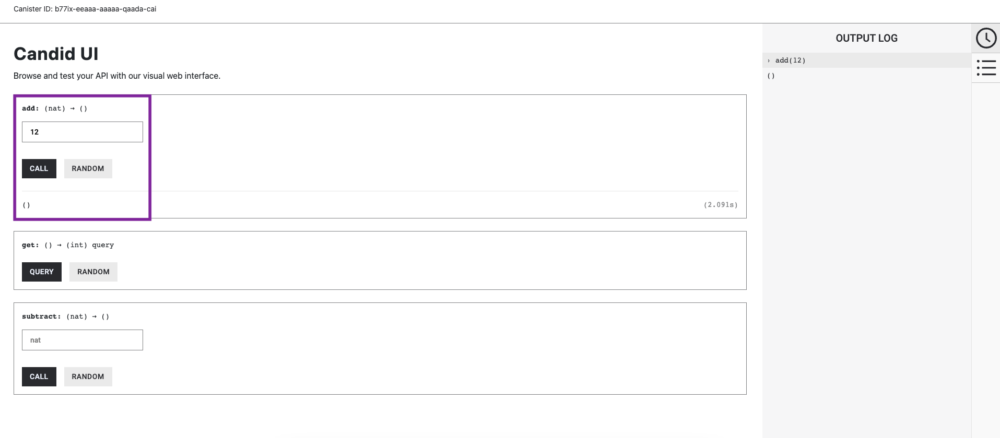
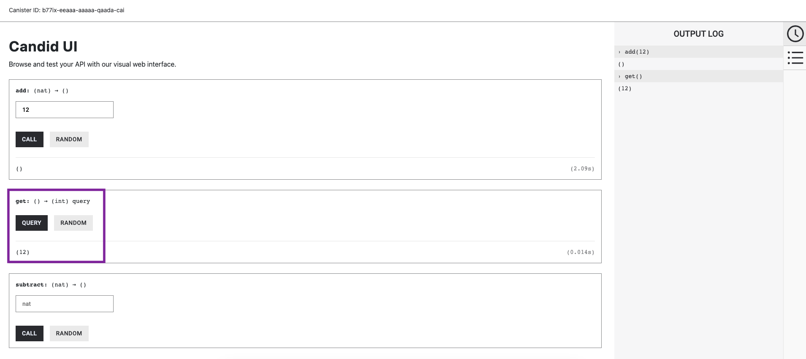
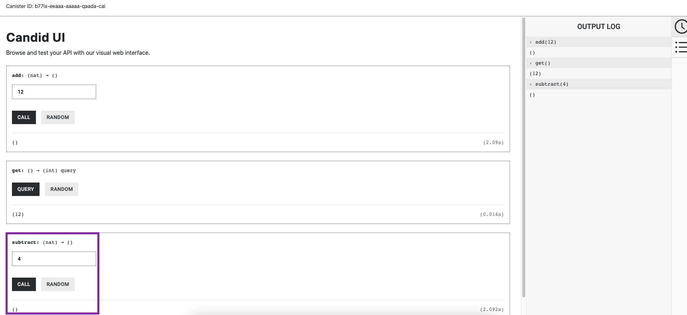
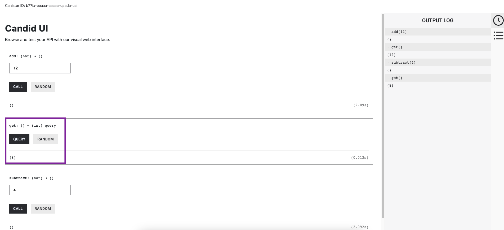

# 2.4: Introduction to Candid 

## Overview

Candid is an interface description language that is used to describe the public interface of a service. A **service** is usually in the form of an application deployed as a canister on the IC. Public interfaces of canisters are used to interact with the canister, and Candid supports interactions through the IC SDK via the terminal, through a web browser, or through the use of agents. Candid provides a way to specify input argument values and display return values from different canister **methods**, regardless of the manner used to interact with the canister. Recall that a method is a piece of code specifying a task which declares a sequence of arguments and their associated result types.

Candid is language-agnostic, which is a key benefit since it allows for the inter-operation between backend canisters and frontend canisters written in different languages, such as Motoko, Rust, and JavasScript. 

Candid is unique since it provides functionality and features not available in other technologies, such as JSON or XML. Some of these features include the evolution of service interfaces, direct value mapping for Candid values to the types and values of the canister's language, and the ability to pass complex data such as references to services and methods. Candid also has built-in support for IC-specific features like query annotation. 

Up until now in this developer journey, we've utilized the Candid UI a few times through the web browser. If you recall, in several tutorials we've interacted with the backend canisters in the web browser with the URL from an output such as:

```
  Backend canister via Candid interface:
    dependencies_backend: http://127.0.0.1:8080/?canisterId=bd3sg-teaaa-aaaaa-qaaba-cai&id=bkyz2-fmaaa-aaaaa-qaaaq-cai
```

These URLs take us to the Candid user interface (UI). Now it's time to take a closer look at the fundamentals of Candid to understand how it works and how it can be used for more complex dapp development. 

## Candid types and values

Candid supports the following set of types in order to provide a natural mapping of data types based on reasonable choices suited for each canister language:

- Unbounded integral number types (`Nat`, `Int`).

- Bounded integral numbers (`Nat8`, `Nat16`, `Nat32`, `Nat64`, `Int8`, `Int16`, `Int32`, `Int64`).

- Floating point types (`Float32`, `Float64`).

- Boolean type (`Bool`).

- Textual data (`Text`).

- Binary data (`Blob`).

- Container types and variants (`Opt`, `Vec`, `Record`, `Variant`).

- Reference types (`Service`, `Func`, `Principal`).

- Special types `Null`, `Reserved` and `Empty`. 

Each of these types is described in detail in the [Candid reference documentation](/docs/references/candid-ref.md).


### Candid textual values

Typically, as a developer you may not work with your program data as Candid values; instead, you may work with a host language such as Javascript and utilize Candid to transparently transport your dapp's data to your canister written in Motoko or Rust. The receiving canister treats this data as native Motoko or Rust values. 

In some scenarios, like debugging, logging, or interacting with a service via the terminal command-line, it may be useful to see the Candid values in a human-readable format. In these situations, the textual presentation of Candid values can be used. 

The syntax for the textual presentation of Candid values is similar to that of Candid types. An example of a textual presentation for a Candid value is:

```
(record {
  first_name = "John";
  last_name = "Doe";
  age = 14;
  membership_status = variant { active };
  email_addresses =
    vec { "john@doe.com"; "john.doe@example.com" };
})
```

In contrast, the Candid binary format uses numeric hashes in place of field names. As a result, printing a value without the knowledge of what type that value is will not include the field name of records or variants. The above example would be printed as follows:

```
(record {
   4846783 = 14;
   456245371 = variant {373703110};
   1443915007 = vec {"john@doe.com"; "john.doe@example.com"};
   2797692922 = "John"; 3046132756 = "Doe"
})
```

## Candid service descriptions

Now that we've discussed Candid types, we can learn about how to use them to describe a service. Candid uses a service description file (file extension `.did`). Let's take a closer look at the structure of a service description. 

### The `.did` file

To define Candid types and describe a service, a Candid service description file can be used. This file has the extension `.did`, and can be generated from a service implementation or written manually. 

The Candid files we have used thus far in the developer journey have been generated automatically. This is because Motoko canisters are automatically generated by the Motoko compiler when the canister is compiled and stored in the project's `/declarations` directory. When Candid files are auto-generated, it is not recommended to edit them manually and any changes made to the file will be overwritten by `dfx` the next time the project is built and deployed. For canisters written in other languages like Rust, the Candid file must be written manually. 

### Example Candid service descriptions 

The simplest service description defines a service with no public methods. This would look like:

```
service : {}
```

Since this service description does not have any pubic methods, it is not very useful. To add a public method, we'll add a simple `ping` method:

```
service : {
  ping : () -> ();
}
```

Now our service description supports a single public method named `ping`. Note that method names can be arbitrary strings that can be quoted, such as "this is a method".

In this `ping` method, there are no arguments passed to the method and there are no results returned, so the empty sequence of `()` is used for both the arguments and the results.

### Generating service descriptions

Now that we've taken a look at writing a Candid service description manually, let's take a look at how to generate the service description from your code. 

:::info
Generating Candid files is supported for canisters written in Motoko. Canisters written in other languages will need to have their Candid files written manually. Check out the [Candid interface description](/docs/references/candid-ref.md) for more information on manually writing the service description. 
:::

The following is an example Motoko canister:

```motoko
actor {
  var v : Int = 0;
  public func add(d : Nat) : async () { v += d; };
  public func subtract(d : Nat) : async () { v -= d; };
  public query func get() : async Int { v };
}
```

When this code is compiled, the Motoko compiler will automatically generate a Candid service description file. This file will resemble the following:

```
service counter : {
  add : (nat) -> ();
  subtract : (nat) -> ();
  get : () -> (int) query;
}
```

This example describes a service called `counter` that consist of the following public methods:

- The `add` and `subtract` methods, which change the value of the counter.
- The `get` method, which reads the current value of the counter. 
- The `subscribe` method, which can be used to invoke another function, such as invoke a notification every time the counter value changes using a callback method. 

This example Candid interface description helps to illustrate that every method has a sequence of argument and result types. Methods can also include annotations, like the query notation shown in this example (`() -> (int) query;`), which is a feature specific to the IC. 

For canisters written in other languages such as Rust, you can develop your service using the language's native types. For example, if you are using Rust types
In other languages, like Rust or C, you can still develop your service using the types that are native to that language, for example, using native Rust types. 

For examples of how to write Candid service descriptions for Rust programs, see the Rust CDK examples and the Rust tutorials.

Regardless of the host language you use, it is important to know the mapping between host language types and Candid types. In the supported types reference section, you’ll find Candid type mapping described for Motoko, Rust, and JavaScript.

## Service upgrades

As your application changes and evolves over time, the methods will most likely change as well. New methods may be introduced, existing methods may expect additional arguments, or new data may be returned. Ideally, developers want to make these changes without breaking any existing workflows or clients. 

Candid supports service upgrades through a set of specific rules that indicate when a new service type will be able to communicate with any running clients that are using the previous interface description. Services can be upgraded in the following ways:

- New methods can be added.

- Existing methods can return additional values; clients using the previous interface description will ignore these additional values. 

- Existing methods can shorten their parameter list; clients using the previous interface description may still send extra arguments, but they will be ignored. 

- Existing methods can extend their parameter list with optional arguments; clients using the previous interface description who do not pass that argument will use a `null` value. 

- Existing parameter types may be changed, but only as a supertype of the previously used type.

- Existing result types may be changed, but only as a subtype of the previously used type.

For additional information about the supertypes and subtypes of any given type, check out the [Candid interface reference documentation](/docs/references/candid-ref.md) for each type.

To demonstrate an example of how a service might be upgraded, let's use the `counter` service example that we looked at in [generating service descriptions](#generating-service-descriptions).

Let's start with the following Candid service description:

```
service counter : {
  add : (nat) -> ();
  subtract : (nat) -> ();
  get : () -> (int) query;
}
```

This service might be upgraded in the following manner:

```
type timestamp = nat; // Define a new type of 'timestamp'
service counter : {
  set : (nat) -> (); // Define a new method
  add : (int) -> (new_val : nat); // Change the parameter result types
  subtract : (nat, trap_on_underflow : opt bool) -> (new_val : nat); // Change the parameter result types
  get : () -> (nat, last_change : timestamp) query; // Change the result types
} 
```

## Using Candid

Now that we've taken a deep dive into Candid, let's explore the different ways to use it. There are three main ways to interact with Candid: using `dfx` on the command-line, using the web browser, and using an agent. For this tutorial, we'll look at using `dfx` and using the web browser; we'll dive into agents in a future section of the developer journey.

### Prerequisites

Before you start, verify that you have set up your developer environment according to the instructions in [0.3: Developer environment setup](../level-0/03-dev-env.md).

### Creating a new project

To get started, create a new project in your working directory. Open a terminal window, navigate into your working directory (`developer_journey`), then use the commands:

```
dfx start --clean --background
dfx new candid_example
cd candid_example
```

We'll be using the sample Motoko canister that we looked at in the [generating service descriptions](#generating-service-descriptions) section earlier. Open the `src/candid_example_backend/main.mo` file in your code editor and replace the existing code with the following:

```motoko
actor {
  var v : Int = 0;
  public func add(d : Nat) : async () { v += d; };
  public func subtract(d : Nat) : async () { v -= d; };
  public query func get() : async Int { v };
}
```

Save this file. Then, compile and deploy the project with the command:

```
dfx deploy
```

Recall that the Motoko compiler will automatically generate the Candid service description file based off of this code. This Candid file can be found at `src/declarations/candid_example_backend/candid_example_backend.did` and will contain the following:

```
service : {
  add: (nat) -> ();
  get: () -> (int) query;
  subtract: (nat) -> ();
}
```

### Interacting with a service using the command-line terminal

Now that our canister is deployed, let's use `dfx` to interact with the methods defined by our Candid file. This section of tutorial will look familiar, since in previous tutorials we've interacted with canisters in the same manner - we just hadn't known we were directly interacting with the Candid defined services since the Candid files had been automatically generated for us in the background. 

For example, let's call the `add` method to add a number to our counter with the command:

```
dfx canister call candid_example_backend add 12
```

Then, we can call the `get` method to return the value we just added:

```
dfx canister call candid_example_backend get  
(12 : int)
```

We can then subtract from this value with the command:

```
dfx canister call candid_example_backend subtract 4
```

Then call the `get` method again:

```
dfx canister call candid_example_backend get  
(8 : int)
```

Reset the counter's value by subtracting the remaining value:

```
dfx canister call candid_example_backend subtract 8
```


### Interacting with a service using a web browser 

Based on the types of services offered by a canister, Candid can provide a web interface, known as the Candid UI, that allows the developer to call canister functions for debugging and testing from within a web browser. This functionality does not require the development of any frontend code and does not require a frontend canister be created or deployed. 

To interact with the Candid UI from a web browser, recall that when a canister is deployed, the following output is returned:

```
Deployed canisters.
URLs:
  Frontend canister via browser
    candid_example_frontend: http://127.0.0.1:8080/?canisterId=by6od-j4aaa-aaaaa-qaadq-cai
  Backend canister via Candid interface:
    candid_example_backend: http://127.0.0.1:8080/?canisterId=avqkn-guaaa-aaaaa-qaaea-cai&id=b77ix-eeaaa-aaaaa-qaada-cai
```

In this output, you can see the URL for the Candid interface under 'Backend canister via Candid interface'. Opening this URL in a web browser will display the following UI:


Let's use the same workflow we used on the command-line. First, let's add 12 to the counter by entering '12' into the 'add' method, then selecting 'call'. The output log on the left will reflect this call.



Then, use the 'get' method's `query' button to query the counter's value. This will be returned in the output log as well:



Subtract 4 from the counter by entering '4' into the 'subtract' method, then selecting 'call'.



Lastly, call the 'get' method again to return our final counter value:



## Next steps

Next, let's explore how to test and debug projects and canisters. 

- [2.5: Unit, integration, and end2end testing](2.5-unit-testing.md).