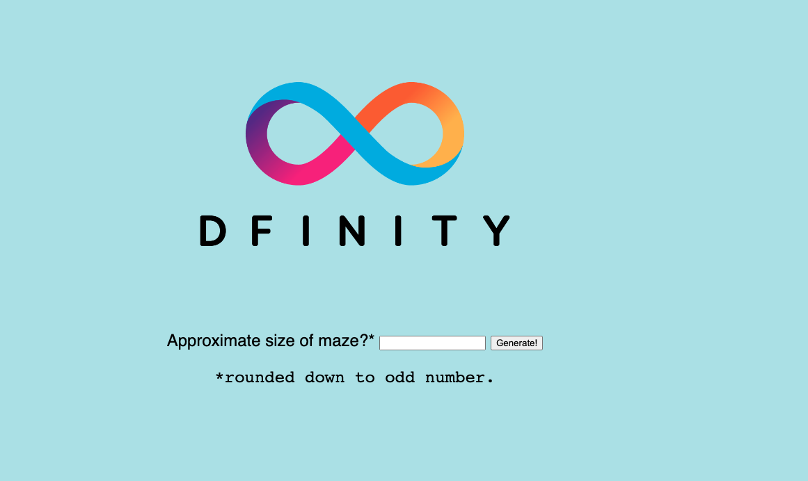
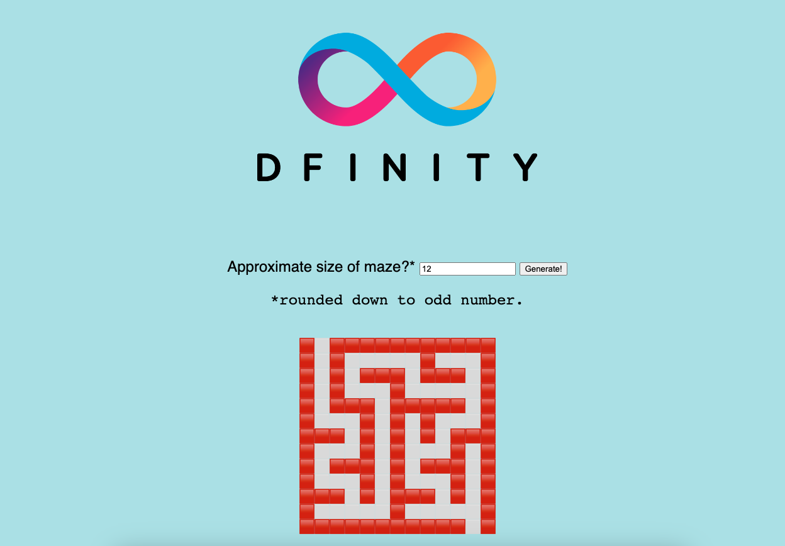

# 3.4 Introduction to agents

## Overview

When you have a canister running, either locally or on the mainnet, you have two primary ways for interacting with the canister: using the API through an agent, or using the canister's HTTP interface. On the Internet Computer, an **agent** is a library used to make calls to ICP's public interface. 

## What does an agent do? 

### Structuring data

One of the first responsibilities of an agent is to structure data. As was discussed in previous modules, such as [2.2: Advanced canister calls](../level-2/2.2-advanced-canister-calls.md), calls to ICP can be an update or a query call. An agent submits a `POST` request to the canister's API at the URL `/api/v2/canister/<effective_canister_id>/call`. This post request contains the following components:

- `request_type`.
- Authentication, comprised of the `sender`, `nonce`, and `ingress_expiry`. 
- `canister_id`.
- `method_name`.
- `request_id`, which is required for update calls. The `request_id` value is the result of hashing the other fields in the request, and is used for polling while ICP reaches consensus on the update call. **Polling** is a technique used to check for fresh data over a given interval of time by making repeated API requests to a server. 
- `arg`, which contains the rest of the call's payload. The agent assembles the `arg` portion of the call with data from the client application, ensuring that the Candid interface matches the method that it calls. 

Each of these components are assembled into a certificate, which is then transformed into a [CBOR-encoded](https://cbor.io/) buffer. The agent takes this CBOR-encoded certificate and attaches it to the body of the `POST` request. When the canister begins to process the request asynchronously, the agent begins polling the `read_status` requests until the canister returns a response. 

The agent takes the CBOR-encoded certificate and attaches it to the body of the POST request. The canister will work on that request asynchronously, and then the agent can begin polling with read_state requests, until the canister response is ready.

### Decoding data

Once a response has been returned from the mainnet, the agent takes the certificate from the call's payload and verifies it. This certificate can be verified using the public root key of ICP's NNS subnet. The network will return a CBOR-encoded buffer for the agent to decode, then transform into a useful structure using semantic language-specific types. For example, if the canister returns a type `Text`, and the agent is a JavaScript agent, the text will get turned into a JavaScript string. 

### Managing authentication

Each call to the Internet Computer mainnet needs to have a cryptographic identity attached to the call. This identity can be anonymous or authenticated using a cryptographic signature. Canisters use a call's attached identity to determine how to respond to the call, which enables smart contracts to use identities for other purposes as well. 

#### Accepted identities

The following types of signatures in identities can be attached to calls to ICP:

- [Ed25519](https://ed25519.cr.yp.to/) and [ECDSA](https://en.wikipedia.org/wiki/Elliptic_Curve_Digital_Signature_Algorithm) signatures.
    - Plain signatures are supported for the schemes.
- [Ed25519](https://ed25519.cr.yp.to/) or [ECDSA](https://en.wikipedia.org/wiki/Elliptic_Curve_Digital_Signature_Algorithm) on curve P-256 (also known as [secp256r1](https://neuromancer.sk/std/secg/secp256r1)).
    - Using SHA-256 as a hash function.
    - Using the Koblitz curve in [secp256k1](https://en.bitcoin.it/wiki/Secp256k1).

When an agent encodes these identities as a principal, they attach a suffix byte which indicates whether the identity is anonymous or self-authenticating. An anonymous identity will use a suffix byte of `4`, which resolves to `2vxsx-fae`, while self-authenticating identities that uses one of the curves above uses a suffix of `2`. 

## Available agents

Currently, there are two agents developed by DFINITY: the [JavaScript/TypeScript](/docs/current/developer-docs/agents/javascript-intro) agent, and the [Rust](/docs/current/developer-docs/agents/ic-agent-dfinity) agent. 

Additionally, there are several community-supported agents, including:

- .NET
  - [`ICP.NET` by Gekctek](https://github.com/Gekctek/ICP.NET)
- Dart
  - [`agent_dart` by AstroX](https://github.com/AstroxNetwork/agent_dart) (supports mobile development with Flutter)
  - [`ic_dart_tools` by Levi Feldman](https://github.com/levifeldman/ic_tools_dart)
- Go
  - [`IC-Go` by MixLabs](https://github.com/mix-labs/IC-Go)
  - [`agent-go` by Aviate Labs](https://github.com/aviate-labs/agent-go)
- Java
  - [`ic4j-agent` by IC4J](https://github.com/ic4j/ic4j-agent) (supports Android)
- Python
  - [`ic-py` by Rocklabs](https://github.com/rocklabs-io/ic-py)
- C
  - [`agent-c` by Zondax](https://github.com/Zondax/icp-client-cpp) (C Wrapper for IC Rust Agent)
- Ruby
  - [`ic_agent` by Terry.Tu](https://github.com/tuminfei/ic_agent)


## Using the JavaScript agent

Let's take a look at using the JavaScript agent to connect to ICP in a web browser. 

### Prerequisites

Before you start, verify that you have set up your developer environment according to the instructions in [0.3: Developer environment setup](../level-0/03-dev-env.md).

:::info
Certain versions of Node.js may cause errors with agent-js. It is recommended to use versions 12, 14, or 16 to avoid potential errors.
:::

### Creating a new project

To get started, open a terminal window, navigate into your working directory (`developer_journey`), then use the following commands to start `dfx` and clone the sample code's repository:

```
dfx start --clean --background
git clone https://github.com/dfinity/examples/
cd examples/motoko/random-maze
npm install
```

### Generating Candid declarations 

For this example, you'll use an example project that takes a variable size input and generates a random maze using that size. For example, if `6` is entered, a 6x6 maze will be generated. Recall  that Motoko projects have the ability to autogenerate the project's Candid files. Let's start with generating those Candid files with the command:

```
dfx generate
```

This command writes the following files to the project's `src/declarations`:

```
|── src
│   ├── declarations
│   │   ├── random_maze
│   │   │   ├── random_maze.did
|   |   |   ├── random_maze.did.d.js
│   │   │   ├── random_maze.did.d.ts
│   │   │   ├── random_maze.did.js
│   │   │   ├── index.d.ts
│   │   │   └── index.js
```

Now, let's view the contents of the Candid interface file for the `random_maze` canister:

`src/declarations/random_maze/random_maze.did`:

```
service : {
  generate: (nat) -> (text);
}
```

Recall that this Candid interface specification defines a service interface with a single method. The single method, `generate` accepts a single argument of type `Nat` and returns type `Text`. This is because you will enter a number (`Nat`) to generate the maze, which will then be displayed using emoji characters displayed using type `Text`. Recall that unless a call is defined as a query, all calls are treated as an update call by default. 

In JavaScript, type `Text` maps to type `String`. You can see a full mapping list of Candid types and their JavaScript equivalents in the [Candid types reference.](/docs/current/references/candid-ref).

Next, let's look at the `src/declarations/random_maze/random_maze.did.d.ts`:

```typescript
import type { Principal } from '@dfinity/principal';
import type { ActorMethod } from '@dfinity/agent';

export interface _SERVICE { 'generate' : ActorMethod<[bigint], string> }
```

In this file, the `_SERVICE` export includes the generate method with typings for an array of arguments and a return type. This export will be typed as an `ActorMethod`, which will be used as a handler that takes arguments and returns a response that resolves with the specified type in the Candid declaration. 

Then, open the `src/declarations/random_maze/random_maze.did.js` file:

```javascript
export const idlFactory = ({ IDL }) => {
  return IDL.Service({ 'generate' : IDL.Func([IDL.Nat], [IDL.Text], []) });
};
export const init = ({ IDL }) => { return []; };
```

In this file, the `idlFactory` function is defined. This handles the structuring of the network calls according to the Internet Computer API and the application's Candid declaration. Unlike the declarations in the `src/declarations/random_maze/random_maze.did.d.ts` file, the `idlFactory` must be available during the application's runtime. To accomplish this, the `idlFactory` gets loaded by an actor. 

In this example, the `idlFactory` represents a service with a `generate` method using the same two arguments you defined before (type `Nat` and type `Text`), though it includes a third argument of an empty array, which represents additional annotations that the function may be tagged with, such as 'query'. 

### Creating the JavaScript agent

Now, let's put all of these different pieces together in the `src/declarations/random_maze/index.js` file:

```javascript
import { Actor, HttpAgent } from "@dfinity/agent";

// Imports and re-exports candid interface
import { idlFactory } from "./random_maze.did.js";
export { idlFactory } from "./random_maze.did.js";

/* CANISTER_ID is replaced by webpack based on node environment
 * Note: canister environment variable will be standardized as
 * process.env.CANISTER_ID_<CANISTER_NAME_UPPERCASE>
 * beginning in dfx 0.15.0
 */
export const canisterId =
  process.env.CANISTER_ID_RANDOM_MAZE ||
  process.env.RANDOM_MAZE_CANISTER_ID;

export const createActor = (canisterId, options = {}) => {
  const agent = options.agent || new HttpAgent({ ...options.agentOptions });

  if (options.agent && options.agentOptions) {
    console.warn(
      "Detected both agent and agentOptions passed to createActor. Ignoring agentOptions and proceeding with the provided agent."
    );
  }

  // Fetch root key for certificate validation during development
  if (process.env.DFX_NETWORK !== "ic") {
    agent.fetchRootKey().catch((err) => {
      console.warn(
        "Unable to fetch root key. Check to ensure that your local replica is running"
      );
      console.error(err);
    });
  }

  // Creates an actor with using the candid interface and the HttpAgent
  return Actor.createActor(idlFactory, {
    agent,
    canisterId,
    ...options.actorOptions,
  });
};

export const random_maze = createActor(canisterId);
```

In this code, the constructor first creates an `HTTPAgent` which wraps the JavaScript API, then uses it to encode calls through the public API. If the deployment is on the mainnet, the root key of the replica is fetched. Then, an actor is created using the automatically generated Candid interface for the canister and is passed the canister ID and the `HTTPAgent`.

:::caution
This example uses `fetchRootKey`. It is not recommended that dapps deployed on the mainnet call this function from agent-js, since using `fetchRootKey` on the mainnet poses severe security concerns for the dapp that's making the call. It is recommended to put it behind a condition so that it only runs locally. 

This API call will fetch a root key for verification of update calls from a single replica, so it’s possible for that replica to respond with a malicious key. A verified mainnet root key is already embedded into agent-js, so this only needs to be called on your local replica, which will have a different key from mainnet that agent-js does not know ahead of time.
:::

Now our actor is set up to call all of the defined service methods; in this instance, there is just the `generate` method. 

Let's deploy our canisters with the command:

```
dfx deploy
```

Then, open the URL for the `random_maze_assets` canister in your web browser:

```
URLs:
  Frontend canister via browser
    random_maze_assets: http://avqkn-guaaa-aaaaa-qaaea-cai.localhost:4943/
  Backend canister via Candid interface:
    random_maze: http://asrmz-lmaaa-aaaaa-qaaeq-cai.localhost:4943/?id=by6od-j4aaa-aaaaa-qaadq-cai
```

### Using the agent

Now let's interact with the frontend of our canister, which is using the JavaScript agent (`index.js`) to interact with the smart contract code stored in the `src/random_maze/main.mo` file. 



Enter a value, then select 'Generate!'. You will see a random maze generated in the UI:



That'll wrap things up for this module! You can read more about agents, such as the Node.js agent, [here](/docs/current/developer-docs/agents/).

## Need help?

Did you get stuck somewhere in this tutorial, or feel like you need additional help understanding some of the concepts? The ICP community has several resources available for developers, like working groups and bootcamps, along with our Discord community, forum, and events such as hackathons. Here are a few to check out:

- [Developer Discord community](https://discord.com/invite/cA7y6ezyE2), which is a large chatroom for ICP developers to ask questions, get help, or chat with other developers asynchronously via text chat. 

- [Developer journey forum discussion](https://forum.dfinity.org/t/developer-journey-feedback-and-discussion/23893).

- [Developer tooling working group](https://www.google.com/calendar/event?eid=MHY0cjBubmlnYXY1cTkzZzVzcmozb3ZjZm5fMjAyMzEwMDVUMTcwMDAwWiBjX2Nnb2VxOTE3cnBlYXA3dnNlM2lzMWhsMzEwQGc&ctz=Europe/Zurich).

- [Motoko Bootcamp - The DAO Adventure](https://github.com/motoko-bootcamp/dao-adventure) - Discover the Motoko language in this 7 day adventure and learn to build a DAO on the Internet Computer.

- [Motoko Bootcamp - Discord community](https://discord.gg/YbksCUxdzk) - A community for and by Motoko developers to ask for advice, showcase projects and participate in collaborative events.

- [Motoko developer working group](https://www.google.com/calendar/event?eid=ZWVnb2luaHU0ZjduMTNpZHI3MWJkcWVwNWdfMjAyMzEwMTJUMTUwMDAwWiBjX2Nnb2VxOTE3cnBlYXA3dnNlM2lzMWhsMzEwQGc&ctz=Europe/Zurich).

- [Upcoming events and conferences](https://dfinity.org/events-and-news/).

- [Upcoming hackathons](https://dfinity.org/hackathons/).

- [Weekly developer office hours](https://discord.gg/4a7SZzRk?event=1164114241893187655) to ask questions, get clarification, and chat with other developers live via voice chat. This is hosted on our [developer Discord](https://discord.com/invite/cA7y6ezyE2) group.

- Submit your feedback to the [ICP Developer feedback board](http://dx.internetcomputer.org).

## Next steps

Next, let's take a look at identities and authentication.

- [3.5 Identities and authentication](3.5-identities-and-auth.md).