# 4.4 NNS governance and staking

## Overview

When blockchain networks need to be upgraded, traditionally they use a method known as a 'hard fork', which involves substantial work and manual coordination. In comparison, the Internet Computer upgrades itself weekly, which can be seen on the [ICP dashboard](https://dashboard.internetcomputer.org/releases).

Each upgrade made to ICP is first introduced as an NNS proposal. Then, users who stake ICP governance tokens can vote on this proposal. If the proposal is accepted, the upgrade gets executed automatically.

In this tutorial, you'll explore how to use the NNS dapp and how to stake ICP tokens into a neuron to receive NNS voting power.

## What is the NNS?

The Network Nervous System (NNS) is the governing body of the Internet Computer. It is a decentralized autonomous organization (DAO) that is hosted fully on-chain and is responsible for making protocol-level upgrades to ICP. The goal of the NNS is to allow ICP to be governed in a secure, open, and decentralized way. Therefore, it has complete control over the network. Some examples of upgrades made to ICP through the NNS are:

- Upgrade the protocol and software used by the network's node machines.

- Create new subnets.

- Split and divide subnets.

- Configure economic parameters that control how much users pay for resources.

When an NNS proposal is submitted, the network participants vote on whether to adopt the proposed changes or reject them. Voting is done via a liquid democracy, where ICP holders can stake ICP within a voting neuron in return for the ability to vote on proposals that change ICP.

### Neurons

Neurons are entities that hold ICP tokens in return for benefits such as voting power or voting rewards on the NNS. ICP tokens that are staked within a neuron cannot be immediately withdrawn; neurons require a notice be given before ICP can be taken out of the neuron. The length of time before ICP can be withdrawn from a neuron is known as the neuron's "dissolve delay".

The dissolve delay determines how long the neuron will take to dissolve if the neuron is placed into "dissolve mode". Once dissolved, the neuron owner can unlock the staked balance of ICP. This configuration provides neuron owners with an incentive to vote with a long-term view focused on maximizing their ICP's value at a later date. Neuron owners can configure higher dissolve delays up to a maximum of eight years, but cannot decrease it below the natural passage of time.

The neuron's voting power is proportional to the quantity of ICP staked within the neuron, the length of their dissolve delay, and the amount of time since the neuron was created. Neurons can be configured to vote automatically or manually. To vote automatically, the neuron can be configured to follow the voting decision of a group of neurons, where it decides to approve a proposal if more than half of the followed group approves, and rejects the proposal if more than half of the followed group rejects. Voting automatically can be useful for neuron owners who may not have the necessary time to evaluate each proposal, or who do not fully understand a proposal's details.

Anyone holding ICP can create a neuron, and are encouraged to do so through reward incentives. Reward amounts are determined by the amount of ICP locked in the neuron, the neuron's dissolve delay time, the neuron's age, and the proportion of possible votes that it participated in to the sum of total voting activity across all neurons. Rewards are distributed this way because the total reward pool is a capped value that is divided between all NNS voters.

Neurons can also be used to submit new proposals to the NNS. To prevent neurons from spamming proposals, a fee is charged to the neuron if their submitted proposal is rejected.

To learn more about neurons and their attributes, check out the documentation [here](/docs/current/tokenomics/nns/nns-intro#neurons).

### Proposals

If a proposal has a majority approval, it will be accepted and autonomously executed. Proposals each adhere to a specific proposal type, which defines what information the proposal includes. For each proposal type, the NNS maintains a corresponding system function which is executed using the proposal's content to fill the function's parameters whenever a proposal of that type is approved and adopted. Each proposal type is belongs to a proposal topic, such as "#NetworkEconomics" or "#NodeAdmin".

Each NNS proposal contains the following fields:

- Summary: A field of text that describes the proposal.

- URL: The web address of any additional content that is required to evaluate the proposal.

- Proposer: The ID of the neuron that submitted the proposal.

- Proposal type: The type of proposal and what topic it belongs to.

- Parameters: Any parameters that will be passed to the system function that is executed if the proposal is approved.

- Unique identity: A unique identity value the NNS assigns to each proposal it receives.

For detailed information about different proposal types and topics, see the documentation [here](/docs/current/tokenomics/nns/nns-intro#topics).

## Why is the NNS important to developers?

For developers who are focused on building their own dapps and projects, you may be asking, "Why does the NNS matter to me?"

There are several reasons that all users and developers on ICP should be familiar with and take part in the governance of the network through the NNS, but for developers specifically, these reasons include:

- Voting on features and changes that may effect your project's architecture, workflow, or functionality: Developers who stake ICP in a neuron and receive voting rights can have a direct say in whether they agree or disagree with a proposed change or feature, and can vote on the proposal accordingly.

- Having the ability to submit proposals that introduce changes necessary for your project: Neuron owners have the ability to submit proposals for changes or features that they'd like to introduce to enhance their workflows or enable new functionality.

- Receiving ICP rewards that can be converted into cycles, which are necessary for mainnet canister deployments: Neurons that regularly vote on proposals receive rewards in the form of ICP tokens, which can be converted into cycles and then used to pay for a project's resources on the mainnet.

- Gaining a comprehensive understanding of the NNS and SNSs, allowing you to envision creating an SNS for your project: By interacting with the NNS and the SNSs for different applications on ICP, developers can be inspired to turn their application into an SNS as well.

## What is an SNS?

A Service Nervous System (SNS) is an advanced form of a DAO. The underlying architecture of an SNS closely resembles the architecture of the NNS, but instead of being used to control ICP, an SNS is used to control a specific decentralized application that is running on the mainnet. Any dapp running on the mainnet can be handed over to an SNS, which results in the dapp being owned and controlled by a community. When an SNS takes control of a dapp, the dapp is then managed similarly to how the Internet Computer is managed by the NNS. When an SNS is launched, a new unique token is created for the SNS that is then used by the community for participation in the SNS's governance.

The dapp's community can participate in the dapp's SNS through staking the SNS's native token in a neuron. Then, changes to the dapp are proposed to the community via an SNS proposal. SNS voting rights use the same format that voting on the NNS does; anyone can stake the SNS's native token into a neuron, and the neuron's voting power is proportional to the quantity of SNS tokens staked within the neuron, the length of their dissolve delay, and the amount of time since the neuron was created.

You can learn more about SNSs in the following resources:

* [SNS overview page](https://internetcomputer.org/sns).

* [Service Nervous System (SNS) developer docs](https://internetcomputer.org/docs/current/developer-docs/daos/sns/).

* [SNS FAQ](https://internetcomputer.org/sns/faq).

### How an SNS works

While the core architecture of an SNS resembles that of the NNS, the NNS contains additional canisters that provide important functionalities on ICP, such as the cycles minting canister that is responsible for creating cycles and the registry canister that contains the network's topology. In contrast, an SNS contains a few canisters that do not exist on the NNS, with the most notable canister being the swap canister used for a decentralization swap during the launch of the SNS.

SNSs are provided as a system functionality. All SNS canister code is approved by the NNS community and thus all SNSs follow the same upgrade path. Launching a new SNS is also approved by the NNS community, including the initial settings of the SNS and the conditions of the decentralization swap.

An SNS is comprised of the following canisters:

- SNS governance canister.

- SNS [ledger](/docs/current/developer-docs/daos/sns/integrating/ledger-integration) and archive canisters.

- SNS [index](/docs/current/developer-docs/daos/sns/integrating/index-integration) canister.

- SNS root canister.

- SNS decentralization swap canister.

You can learn more about SNS architecture [here](/docs/current/developer-docs/daos/sns/introduction/sns-architecture).

### SNS decentralization swaps

In order for an SNS to be launched, the SNS must have a successful decentralization swap. A decentralization swap is the action of initially funding the SNS by swapping ICP tokens for the SNS's native token. The decentralization swap is done through the SNS decentralization swap canister which is owned and operated by ICP. It is controlled by the NNS root canister.

When the swap starts, there is a pre-defined amount of SNS tokens to be distributed publicly. During the swap, participants can send ICP tokens to the swap canister to contribute to the SNS's initial funding.

When the swap ends, the collected ICP tokens are swapped for the SNS's tokens. Participants that sent ICP tokens to the swap canister receive SNS tokens in the form of SNS neurons. The amount they receive is pro-rated by the amount of ICP tokens they contributed to the overall amount of ICP collected in the swap. For example, if the swap canister initially held 1000 SNS tokens, and 500 ICP tokens were collected during the swap, the exchange rate would be 2:1, meaning each participant would receive 2 tokens for each ICP token they contributed.

The SNS places the collected ICP into an SNS controlled treasury. After a successful swap, the SNS tokens are owned by the community and the SNS is governed by that community.

You can learn more about SNS tokenomics and rewards in the following resources:

* [SNS tokenomics](/docs/current/developer-docs/daos/sns/tokenomics/tokenomics-intro).

* [SNS rewards](/docs/current/developer-docs/daos/sns/tokenomics/rewards).

## SNS resources

To learn more about creating, launching, and managing an SNS, refer to the following resources:

* [SNS launch](/docs/current/developer-docs/daos/sns/launching/launch-summary).

* [An introduction to SNS preparation](/docs/current/developer-docs/daos/sns/tokenomics/).

* [The SNS launch checklist](/docs/current/developer-docs/daos/sns/tokenomics/sns-checklist).

* [Pre-deployment considerations](/docs/current/developer-docs/daos/sns/tokenomics/predeployment-considerations).

* [SNS parameters](/docs/current/developer-docs/daos/sns/tokenomics/preparation).

* [Guidelines how to test an SNS locally](/docs/current/developer-docs/daos/sns/testing/testing-locally).

* [Guidelines how to test the operation of the dapp under SNS control](/docs/current/developer-docs/daos/sns/testing/testing-on-mainnet).

* [Stages included in an SNS launch](/docs/current/developer-docs/daos/sns/launching/launch-summary-1proposal).

* [SNS proposals](/docs/current/developer-docs/daos/sns/managing/making-proposals).

* [Tips regarding cycles management for the canisters](/docs/current/developer-docs/daos/sns/managing/cycles-usage).

* [An introduction to how to use the asset canister with an SNS-controlled dapp](/docs/current/developer-docs/daos/sns/managing/sns-asset-canister).


## Using the NNS dapp

To use the NNS dapp, first navigate to the dapp's URL at https://nns.ic0.app/.

You will be prompted to log in with your Internet Identity. If you need to create one, check out the previous module [3.5 Identities and authentication](../level-3/3.5-identities-and-auth.md).

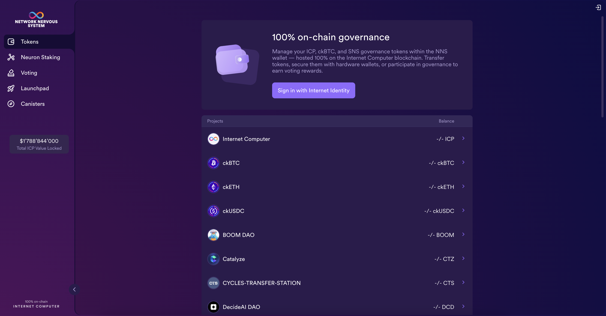

### Transferring ICP tokens into your Internet Identity 'Main' account

Once logged in, you can see your balance for each token on the NNS dapp. Tokens include ICP, ckBTC, and dapp-specific tokens for dapps that have an SNS, such as OpenChat (CHAT) and Hot or Not (HOT). For this tutorial, you'll be staking ICP in an ICP neuron, so assure that you have some ICP tokens available.

If you need to obtain ICP tokens, they can be purchased through a crypto exchange, or they can be received through other activities such as receiving grants from the DFINITY foundation. They will need to be sent to the ICP wallet address shown in the NNS dapp. The following screenshot shows this address beneath the current balance under the 'Main' account with the balance of `5.10 ICP`:

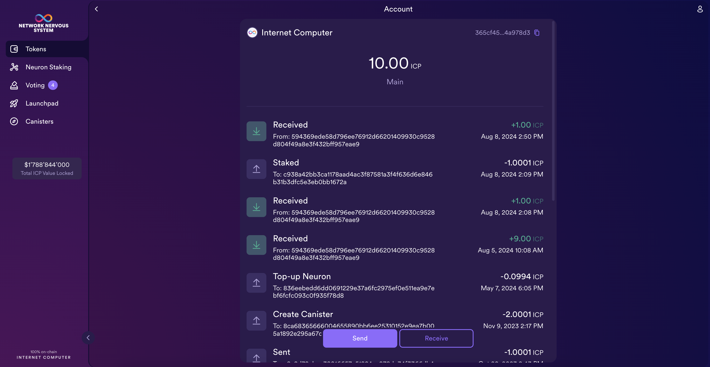

Alternatively, you can send ICP tokens to this Internet Identity address from your local `dfx` developer identity if that is where you have ICP tokens. You can do so with the `dfx ledger` commands. First, get your developer identity principal with the command:

```bash
dfx identity get-principal
```

This command will return your identity's principal:

```bash
tsqwz-udeik-5migd-ehrev-pvoqv-szx2g-akh5s-fkyqc-zy6q7-snav6-uqe
```

Then, check the balance of your identity's ledger account to assure that it is the correct account:

```bash
dfx ledger --network ic balance
```

The flag `--network ic` is required, since you are intending to use real ICP on the mainnet.

If the balance is correct, then you can transfer ICP tokens to your Internet Identity 'Main' address with the command:

```bash
dfx ledger --network ic transfer <DESTINATION> --icp <ICP-AMOUNT> --memo <MEMO>
```

For example, for the 'Main' account in this example, you could transfer 1 ICP to the account with the command:

```bash
dfx ledger --network ic transfer 365cf45f3521653e866a078b157a8d8701c3f63183a6d41ff8ddb913c4a978d3 --icp 1 --memo Developer Journey
```

### Staking ICP in a neuron

To stake your ICP tokens in a neuron, select 'My Neuron Staking' on the left navigation bar. Then select 'Stake Neurons' in the bottom of the window.

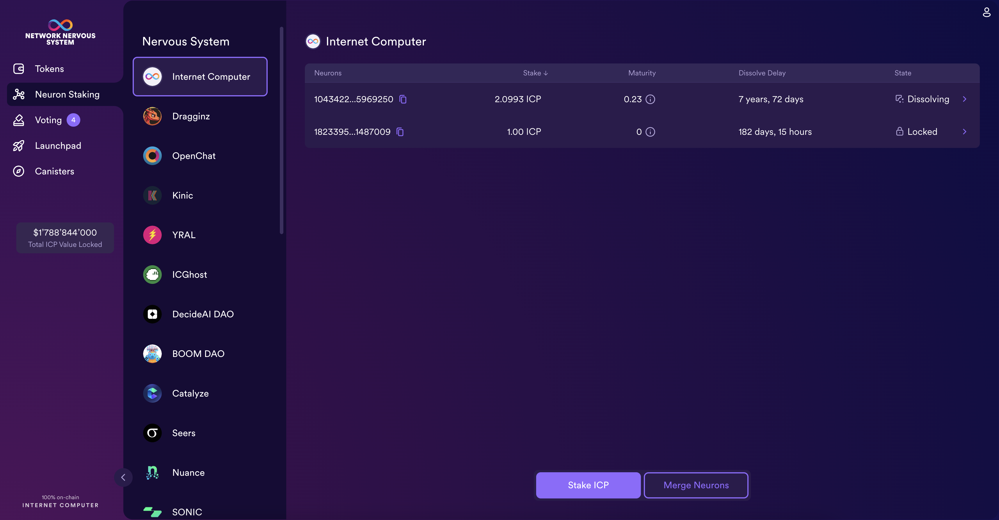

To stake ICP in a neuron, enter how many you'd like to stake and select the source wallet.

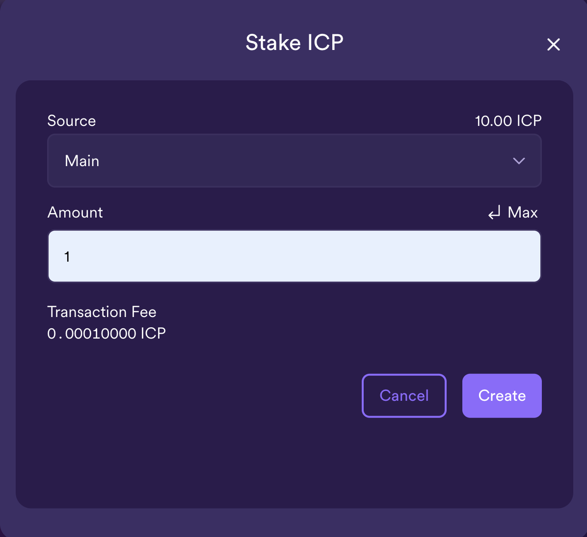

Then, you'll need to set the dissolve delay.

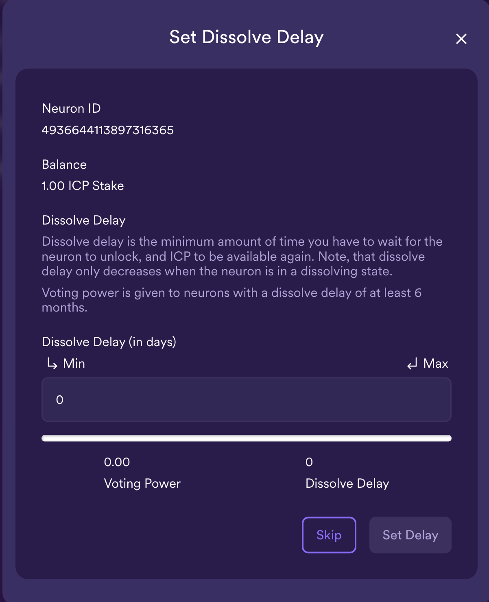

To receive voting power, you'll need to set this value to at least 6 months. Click on the 'Min' button to set the minimum value.

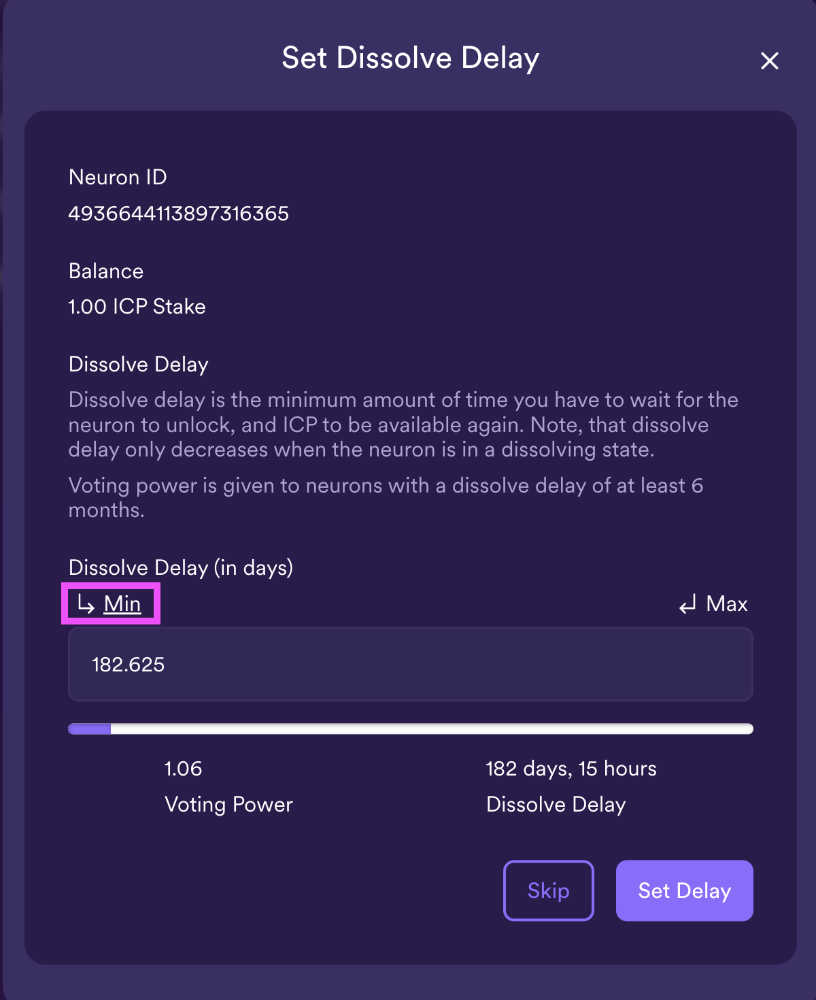

To set the maximum value, select the 'Max' button. The maximum dissolve delay is 8 years.

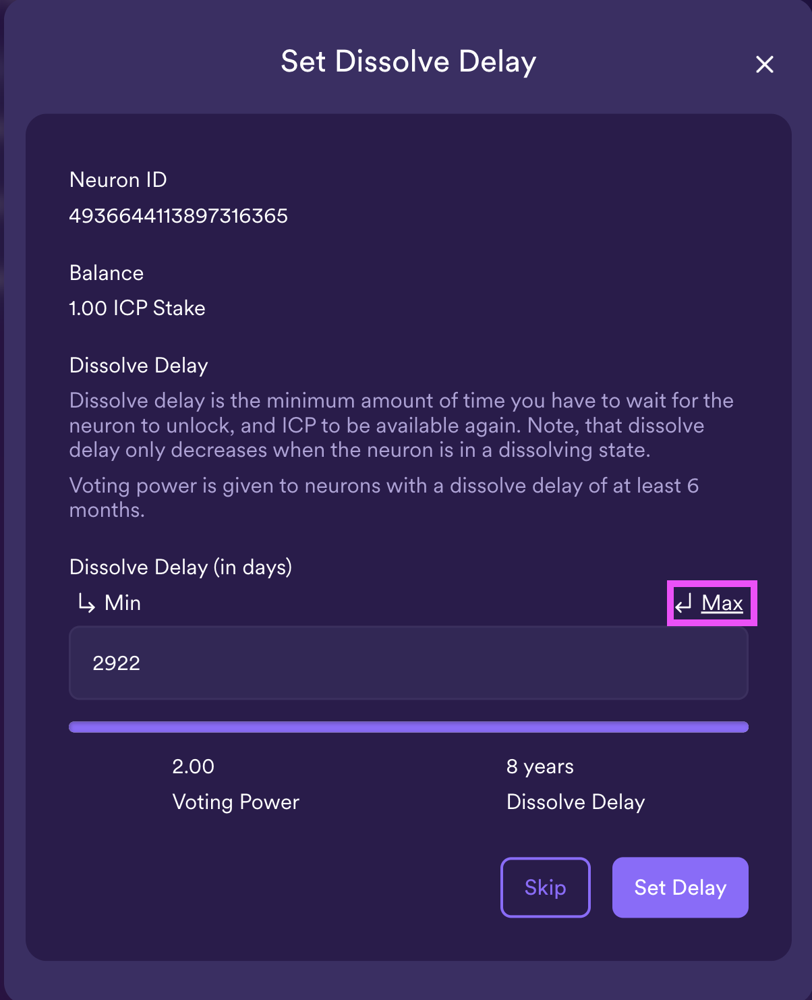

Then confirm the setting to create your neuron.

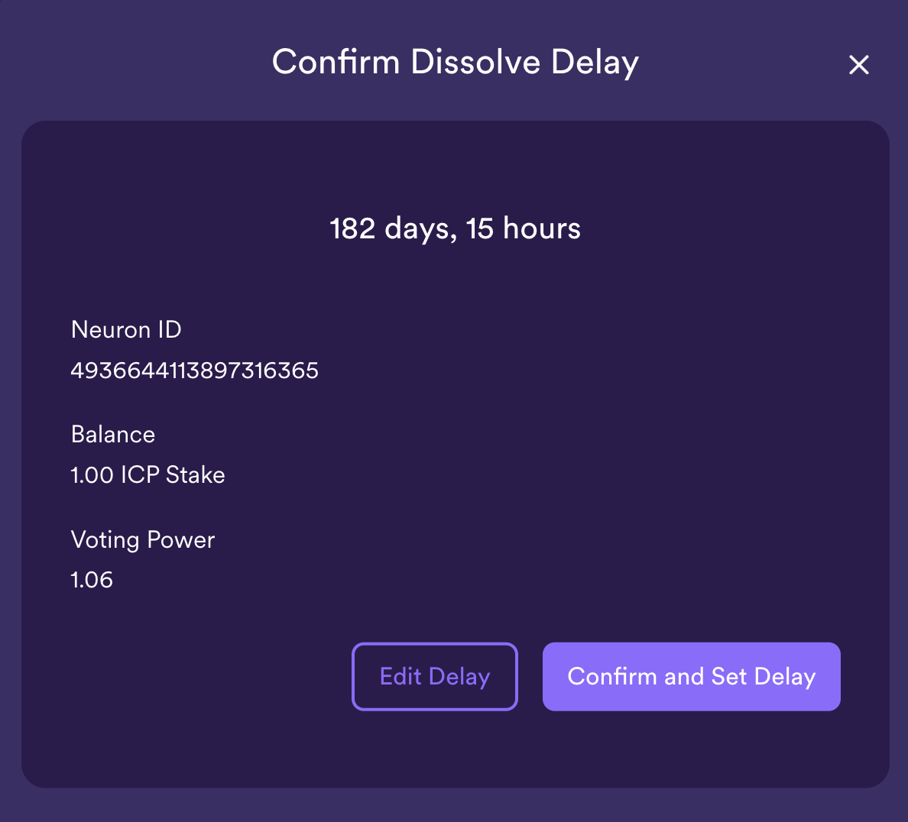

Once your neuron has been created, you can follow other neurons. As was discussed earlier, setting up following will automate your neuron's participation in voting on proposals, allowing you to maximize your neuron rewards. To follow a specific topic, select the drop-down menu next to the group you'd like to follow. In this example, you'll select "All except Governance, and SNS & Neurons' Fund".

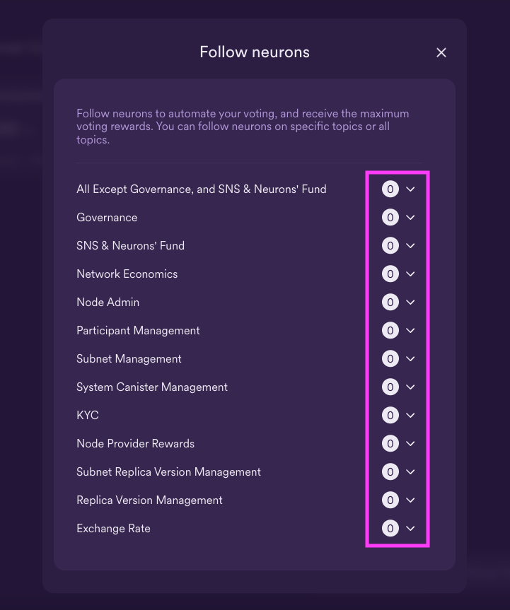

Then, you can select a specific group of neurons to follow by selecting 'Add Followee'.

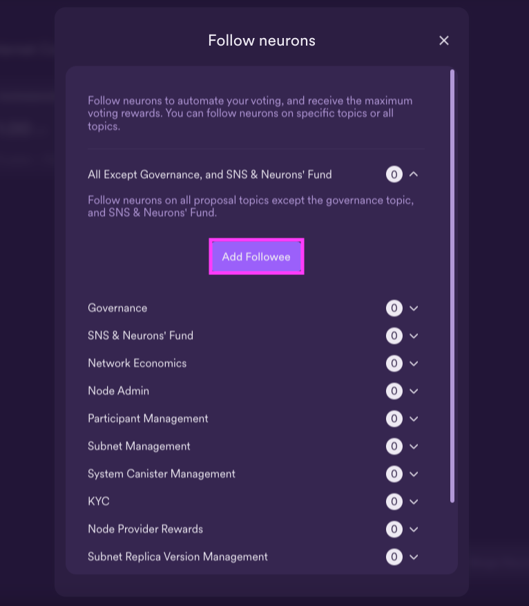

A list of available neurons will be displayed. In this example, you'll follow the 'DFINITY Foundation' neuron.

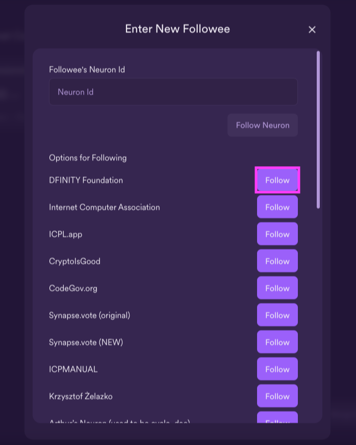

Then confirm that your following settings have been updated.

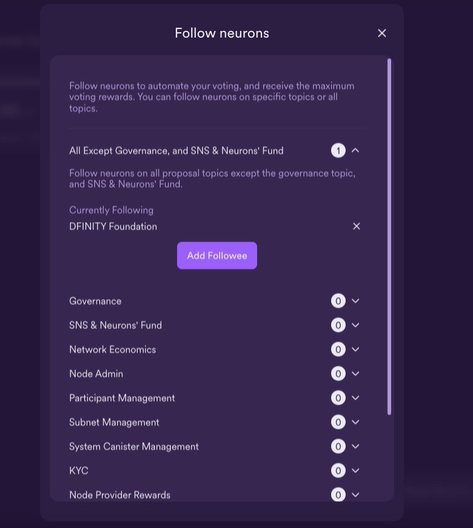

Close this window. Now, let's take a look at the details of our neuron. From the 'My Neuron Staking' page, you will see your neuron, its staked balance, its neuron ID, and its dissolve delay time. Select on the neuron to see additional details.

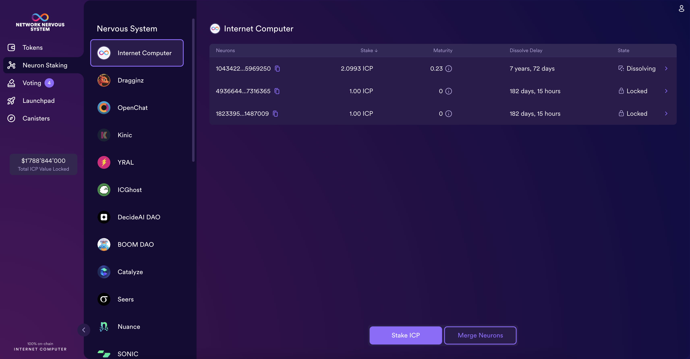

From the neuron's detailed menu, you can execute actions such as increase the staked amount of ICP, increase the dissolve delay, or start dissolving the neuron. You will also see information regarding the neuron's maturity, which will increase over time and by voting on proposals.

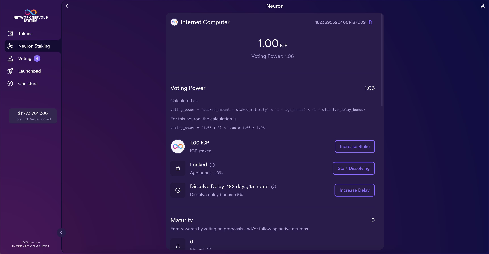

If you scroll further, you can see advanced details and settings, such as when the neuron was created, its neuron account ID, and options to participate in the neurons' fund or split the neuron. For more information about these advanced options, check out the documentation [here](/docs/current/developer-docs/daos/nns/nns-app-quickstart).


Lastly, at the very bottom of the window there will be information about the neurons that are being followed, any hotkeys that are set, and the neuron's voting history.

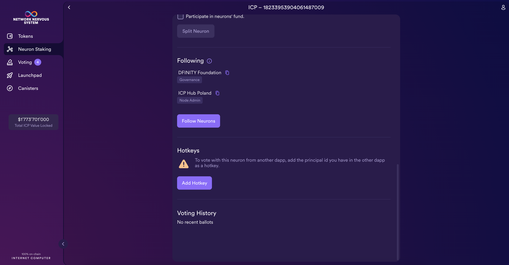

### Interacting with NNS proposals

Earlier, you set up following for our neuron, meaning that the neuron will automatically vote on proposals that fall into the category you configured. To interact with proposals manually, select 'Vote on Proposals' on the left navigation bar, then select 'Internet Computer'. All of the currently available proposals will be displayed.

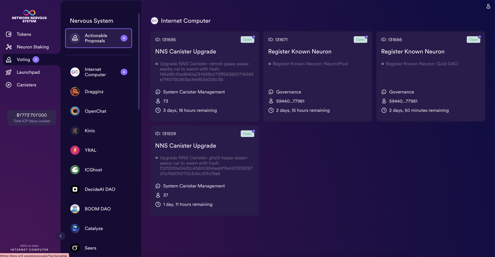

If you click on one, however, you'll notice that you cannot vote on it. That's because the proposals were created prior to the neuron that you just created, so you aren't eligible to vote on the currently open proposals. All future proposals will be available to you.

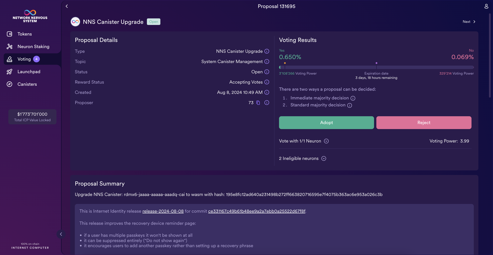

For additional information the NNS dapp, proposals, and neuron staking, check out the [NNS quick start guide](/docs/current/developer-docs/daos/nns/nns-app-quickstart).

## Need help?

Did you get stuck somewhere in this tutorial, or feel like you need additional help understanding some of the concepts? The ICP community has several resources available for developers, like working groups and bootcamps, along with our Discord community, forum, and events such as hackathons. Here are a few to check out:

- [Developer Discord community](https://discord.com/invite/cA7y6ezyE2), which is a large chatroom for ICP developers to ask questions, get help, or chat with other developers asynchronously via text chat.

- [Developer journey forum discussion](https://forum.dfinity.org/t/developer-journey-feedback-and-discussion/23893).

- [Developer tooling working group](https://www.google.com/calendar/event?eid=MHY0cjBubmlnYXY1cTkzZzVzcmozb3ZjZm5fMjAyMzEwMDVUMTcwMDAwWiBjX2Nnb2VxOTE3cnBlYXA3dnNlM2lzMWhsMzEwQGc&ctz=Europe/Zurich).

- [Motoko Bootcamp - The DAO Adventure](https://github.com/motoko-bootcamp/dao-adventure) - Discover the Motoko language in this 7 day adventure and learn to build a DAO on the Internet Computer.

- [Motoko Bootcamp - Discord community](https://discord.gg/YbksCUxdzk) - A community for and by Motoko developers to ask for advice, showcase projects and participate in collaborative events.

- [Motoko developer working group](https://www.google.com/calendar/event?eid=ZWVnb2luaHU0ZjduMTNpZHI3MWJkcWVwNWdfMjAyMzEwMTJUMTUwMDAwWiBjX2Nnb2VxOTE3cnBlYXA3dnNlM2lzMWhsMzEwQGc&ctz=Europe/Zurich).

- [Upcoming events and conferences](https://dfinity.org/events-and-news/).

- [Upcoming hackathons](https://dfinity.org/hackathons/).

- [Weekly developer office hours](https://discord.gg/4a7SZzRk?event=1164114241893187655) to ask questions, get clarification, and chat with other developers live via voice chat. This is hosted on our [developer Discord](https://discord.com/invite/cA7y6ezyE2) group.

- Submit your feedback to the [ICP Developer feedback board](http://dx.internetcomputer.org).

## Next steps

Next, you'll dive into how to use the tool quill:

- [4.5 Using quill](/docs/current/tutorials/developer-journey/level-4/4.5-using-quill).


