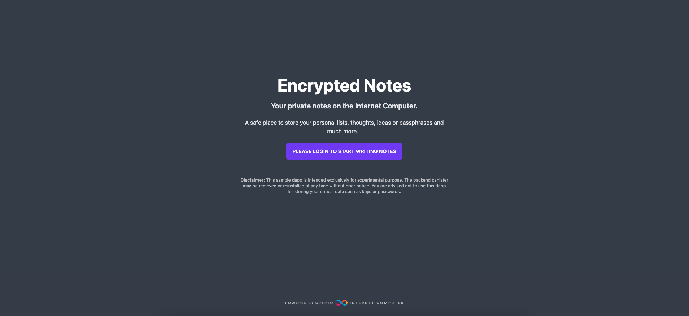
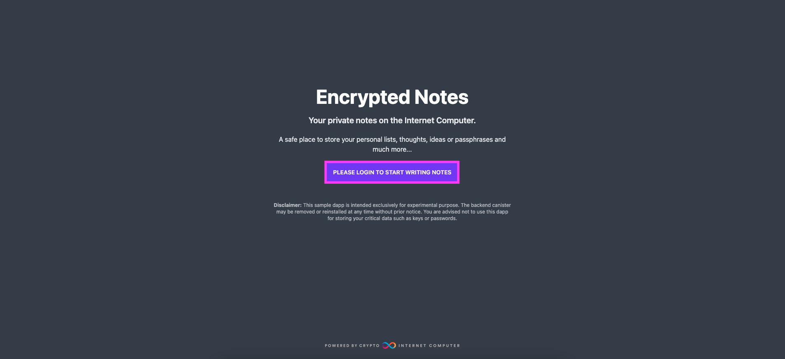
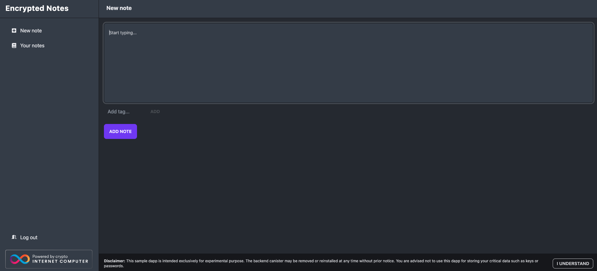
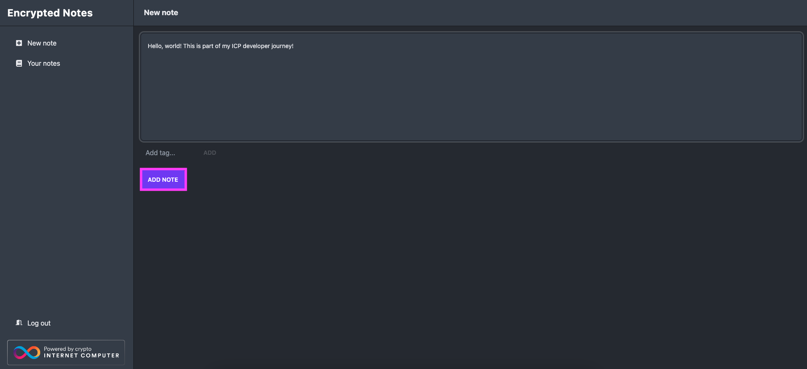
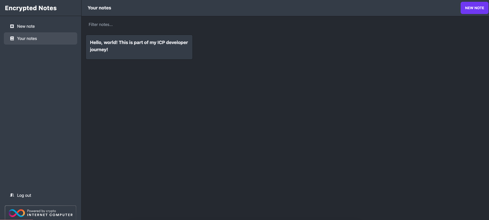

# 5.1 Developing an encrypted notes dapp with vetKeys

## Overview

Many types of applications rely on secure ways to store user data and keep certain aspects of the dapp private. On a blockchain, transactions are traditionally public and dapps might rely on the storage within a web browser to store user-side secrets, which can lead to potential security risks. 

The Internet Computer's vetKeys feature provides developers with more enhanced privacy, encryption, threshold decryption, and security capabilities for their projects and dapps. The goal of vetKeys is to allow developers to retrieve encrypted information from a external locations and share it with different users in a private and secure manner. 

In this tutorial, you'll learn about how vetKeys enables different workflows and use-cases for decentralized applications on ICP, then you'll create a dapp that uses vetKeys to provide a secure, encrypted note-taking application. 

:::caution
The vetKeys feature is still in development, and the proposed system API can be reviewed in the proposed PR [here](https://github.com/dfinity/interface-spec/pull/158).
:::

## What are vetKeys? 

vetKeys stands for Verifiably Encrypted Threshold Keys, and enables several cryptographic functionalities on the Internet Computer. vetKeys focus on facilitating on-chain encryption, data privacy, and security. From a high level, the main objective of vetKeys is to provide a threshold key derivation interface, to allow canisters to obtain encrypted threshold signatures, and to allow for symmetric encryption for public key or identity-based encryption.

To understand vetKeys, first let's cover a few fundamental cryptography concepts and some of their disadvantages that vetKeys strives to solve.

### Crypto primitives

In cryptography, most tools are built from crypto _primitives_. Crypto primitives are core building blocks that can be used with their existing functionality, or it can be used to build other, more complex cryptographic protocols or tools. Some examples of crypto primitives are block ciphers such as [AES](https://en.wikipedia.org/wiki/Advanced_Encryption_Standard), hash functions such as [SHA3](https://en.wikipedia.org/wiki/SHA-3), or signature schemes such as [ECDSA](https://en.wikipedia.org/wiki/Elliptic_Curve_Digital_Signature_Algorithm). 

The vetKeys feature introduces a new primitive, vetKD, which extends the functionality of a primitive known as identity based encryption (IBE). vetKD, or Verifiably Encrypted Threshold Key Derivation, allows encrypted data's decryption keys to be derived on demand. 

### Public key encryption (PKE)

Public key encryption is a commonly used form of encryption that allows for data to be communicated confidentially over a public channel by encrypting the data messages. For example, if User 1 wants to send an encrypted message to User 2, a PKE scheme might follow these steps:

- User 2 can generate public and private key pair using a key generation algorithm.

- User 2 publishes their public key online, such as within a public key infrastructure. 

- User 1 can retrieve User 2's public key, then use it to encrypt a plaintext message to User 2 using an encryption algorithm. This will result in a ciphertext, which is the encrypted plaintext of the message after it is processed with an encryption algorithm. User 1 then can send the ciphertext to User 2.

- User 2 can decrypt the ciphertext using their private key and a decryption algorithm. This will result in the decrypted, plaintext message. 

Since the standard practice of PKE involves storing a public key on a trusted public key infrastructure and securely managing the secret key, PKE can get complicated and difficult quickly, resulting in developers being discouraged to use cryptography in their applications. vetKeys strives to make this aspect of cryptography easier for developers.

### Identity based encryption (IBE)

Identity based encryption addresses some of the pitfalls of PKE, as it allows an arbitrary identifier string (or identity) to be used as a public key that is used to derive the private key. To compare IBE to PKE, consider the following scenario:

- In an IBE scheme, there must be a trusted key deriver (KD), that is used to run the IBE key generation algorithm and generate the master key pair that contains the private and public key based on the identity provided.

- Then, User 1 can run the IBE encryption algorithm to encrypt a plaintext message to User 2 under User 2's identity. This results in a ciphertext, which is then sent to User 2. 

- User 2 authenticates to the KD with their identity and requests the private key that corresponds to their identity. 

- The KD returns User 2's private key to them.

- User 2 uses their private key to decrypt the ciphertext sent from User 1. This will result in the decrypted, plaintext message. 

A important note about IBE is that it requires a central authority (the KD) to derive the decryption key. This is problematic for working with decentralized technologies that do not want to place trust in a central authorities. This is another pitfall that vetKeys strives to address. 

### vetKD

Within vetKeys, the core piece is the key derivation primitive, or vetKD. The key derivation capabilities provided by vetKD are designed to provide key derivation without relying on a central authority by distributing the trust amongst multiple parties, then requiring that a minimum threshold of all parties collaborate to derive the private key. To do this, first a [distributed key generation (DKG)](https://en.wikipedia.org/wiki/Distributed_key_generation) protocol is used to create master keys in a distributed way, resulting in multiple parties (eg. nodes in a network) holding shares of the master keys. Later, when a user wants to derive a decryption key (or vetKey) based on their identity, a threshold of nodes derive the user's vetKey from the user's identity and the shares of the master key they hold.

To further understand vetKD, consider the following scenario on ICP:

- Nodes within the network participate in the DKG process to obtain shares of a master secret key and a master public key. Each node may hold a number of key shares, but no node may hold the majority amount of key shares. 

- User 1 encrypts a message under User 2's identity and the master public key. The resulting ciphertext is sent to User 2. 

- When User 2 wants to decrypt the message they must authenticate their identity to ICP to retrieve their vetKey to decrypt the ciphertext sent by User 1. They start by using a transport key generation (TKG) algorithm to generate a transport public and private key pair. User 2 then sends the transport public key along with their request to authenticate their identity and derive a vetKey. The transport public key gives the network a way to send User 2 encrypted responses. This is the 'E' in vetKD. 

- If User 2's identity authentication passes, the nodes use the DKG algorithm to derive User 2's vetKey using the node's master key shares, then encrypts them using User 2's transport public key. Anyone can use an encryption key share (EKS) verification algorithm to verify that the encrypted key shares contain a legitimate decryption share. This is the 'V' in vetKD. The network's nodes can also combine the encrypted shares to produce the full vetKey for the identity.

- Finally, a recovery algorithm enables User 2 to decrypt the response with their transport private key, which reveals the vetKey corresponding to their identity. User 2 can now decrypt the message sent by User 1.

A crucial point to note is that this allows users to retrieve decryption keys (or vetKeys) from any device, at any time, overcoming one of the core pain points of public key encryption. vetKeys are made possible by leveraging the extremely useful properties of BLS signatures.

### BLS signatures

[BLS signatures](https://en.wikipedia.org/wiki/BLS_digital_signature) are a type of digital signature introduced in 2001. The name BLS comes from the authors of the signature, Dan Boneh, Ben Lynn, and Hovav Shacham. Threshold BLS signatures are widely used across the Internet Computer because they are short, unique, easy to port into a distributed setting, and are fast to compute. 

BLS signatures use three algorithms: 

- A key generation algorithm that may be distributed or not. 

- A signing algorithm.

- A verification algorithm. 

In a threshold setting, BLS signatures include a fourth, combination algorithm.

To demonstrate how BLS signatures are used on ICP, consider the following scenario that ICP might use to validate that a message sent to an end-user (User 1) has been sent from ICP:

- Nodes on the network participate in the distributed key generation (DKG) process and obtain private key shares. 

- Each node computes a signature share for a message using its share of the signing key. 

- The nodes use the combination algorithm to combine the signature shares and produce a single signature that's sent to User 1. 

- User 1 uses the verification algorithm to check whether the signature that was sent uses the public key of the Internet Computer, validating that it was signed by the nodes on ICP. 

In the scenario of vetKD, the master key of the IBE scheme uses a BLS signature key secret that is shared amongst the nodes. The derived identity is threshold signed, resulting in a signature that acts as a symmetric encryption key. 

Each of these components of vetKeys are described further in the vetKeys primer, which can be found [here](/blog/features/vetkey-primer).

## vetKeys example dapp

In this example, you'll create a dapp that allows you to create notes and encrypt them using vetKeys. The notes will be encrypted with an AES key that is derived from a principal-specific vetKey that the backend canister will obtain using the vetKD system API. This prevents the need for any device management within the dapp. 

:::caution
This example uses an insecure implementation of the proposed vetKD system API. This should not be used in production or for encrypting any sensitive data; this example is for demonstration purposes only.
:::

### Prerequisites

Before you start, verify that you have set up your developer environment according to the instructions in [0.3 Developer environment setup](../level-0/03-dev-env.md).

### Cloning the `encrypted-notes-dapp-vetkd` example

To get started, open a new terminal window, navigate into your working directory (`developer_journey`), then use the following commands to clone the DFINITY examples repo and navigate into the `encrypted-notes-dapp-vetkd` directory:

```bash
git clone https://github.com/dfinity/examples/
cd examples/motoko/encrypted-notes-dapp-vetkd
```

:::info
A Rust version of this project exists at `examples/rust/encrypted-notes-dapp-vetkd`.
:::

### Setting up the project

Since you'll be using the Motoko variation of this project, you will need to set a `$BUILD_END` local environment variable to equal `motoko`:

```bash
export BUILD_ENV=motoko
```

If you'd like to use the Rust variation, set this variable to equal `rust`. 

Next, run the `pre_deploy.sh` script, which will generate some files specific to the build environment; in this case, these will be files for the Motoko variation:

```bash
sh ./pre_deploy.sh
```

This command's output will resemble the following:

```bash
=== Deploying encryptedNotes_motoko ===
--- Generated dfx.json ---
--- Generated src/frontend/src/lib/backend.ts ---
--- Generated src/frontend/src/lib/idlFactory.js ---
```

Now it's time to install the project's required npm packages with the command:

```bash
npm install
```

### Reviewing the project's files

First, start by opening the project's `dfx.json` file to review the project's canisters and configuration:

```json
{
  "canisters": {
    "vetkd_system_api": {
      "candid": "vetkd_system_api.did",
      "type": "custom",
      "wasm": "vetkd_system_api.wasm"
    },
    "encryptedNotes_motoko": {
      "dependencies": [
        "vetkd_system_api"
      ],
      "main": "src/encryptedNotes_motoko/main.mo",
      "type": "motoko"
    },
    "encryptedNotes_rust": {
      "dependencies": [
        "vetkd_system_api"
      ],
      "type": "rust",
      "candid": "src/encryptedNotes_rust/src/encryptedNotes_rust.did",
      "package": "encryptedNotes_rust"
    },
    "www": {
      "dependencies": [
        "encryptedNotes_motoko",
        "vetkd_system_api"
      ],
      "frontend": {
        "entrypoint": "src/frontend/public/index.html"
      },
      "source": [
        "src/frontend/public/"
      ],
      "type": "assets"
    },
    "internet_identity": {
      "candid": "https://github.com/dfinity/internet-identity/releases/latest/download/internet_identity.did",
      "type": "custom",
      "wasm": "https://github.com/dfinity/internet-identity/releases/latest/download/internet_identity_dev.wasm.gz"
    }
  },
  "networks": {
    "local": {
      "bind": "0.0.0.0:8000",
      "type": "ephemeral"
    }
  },
  "version": 1
}
```

Here, you can see there are five canisters defined:

- `vetkd_system_api`: This canister is responsible for providing the vetKD system API that our dapp will use. It is built from local Candid and Wasm files. 

- `encryptedNotes_motoko`: This canister is responsible for the dapp's backend functionality, written in Motoko. This is the backend canister your dapp will use since this tutorial focuses on Motoko development.

- `encryptedNotes_rust`: This canister is responsible for the dapp's backend functionality, written in Rust. This canister will not be deployed in this tutorial, since this tutorial showcases the Motoko development workflow.

- `www`: This canister is responsible for providing the dapp's frontend user interface that you'll use to create encrypted notes from a web browser. 

- `internet_identity`: This canister is a local instance of the Internet Identity canister, and is built from the Candid and Wasm files from the latest DFINITY Internet Identity release. 

You can also see the defined local network, which uses the local address and port `0.0.0.0:8000`. This is the local network that your canisters will be deployed to.

Next, review the `src/encryptedNotes_motoko/main.mo ` file, which contains the core functionality for our dapp. This code has been annotated with notes to explain the program's functionality:

:::info
It is important to note that this backend canister does *not* perform any encryption, since it assumes that the notes are encrypted end-to-end by the front-end (at the client side). 
:::

```motoko
// First, import the necessary libraries:

import Map "mo:base/HashMap";
import Text "mo:base/Text";
import Array "mo:base/Array";
import Buffer "mo:base/Buffer";
import List "mo:base/List";
import Iter "mo:base/Iter";
import Int "mo:base/Int";
import Nat "mo:base/Nat";
import Bool "mo:base/Bool";
import Principal "mo:base/Principal";
import Result "mo:base/Result";
import Option "mo:base/Option";
import Debug "mo:base/Debug";
import Order "mo:base/Order";
import Blob "mo:base/Blob";
import Hex "./utils/Hex";

// Declare a shared actor class and bind the caller and the initializer:

shared({ caller = initializer }) actor class() {

    // Currently, a single canister smart contract is limited to 4 GB of storage due to WebAssembly limitations.
    // To ensure that your canister does not exceed this limit, it is recommended to restrict memory usage to at most 2 GB, as this example does.
    // This includes the assumption that up to 2x memory may be needed for data serialization during canister upgrades. 
    // Therefore, this example dapp can support up to 1,000 users, each storing up to 2 MB of data. 
    // The data is reserved for storing the notes:
    //     NOTES_PER_USER = MAX_NOTES_PER_USER x MAX_NOTE_CHARS x (4 bytes per char)
    //     2 MB = 500 x 1000 x 4 = 2,000,000

    // Next, define the dapp's limits. This is important for security assurance:

    private let MAX_USERS = 1_000;
    private let MAX_NOTES_PER_USER = 500;
    private let MAX_NOTE_CHARS = 1000;

    // Define private a type for PrincipalName:

    private type PrincipalName = Text;

    // Define a public type for EncryptedNote:

    public type EncryptedNote = {
        encryptedTest: Text;
        id: Nat;
    };

    // Next, define private fields.
    // Stable actor fields are automatically retained across canister upgrades. 
    // You can learn more about upgrades in the Motoko docs: https://internetcomputer.org/docs/current/motoko/main/upgrades/

    // As a design choice, this canister uses globally unique note identifiers for all users.
    // This identifier is a stable variable, which allows the value to persist across canister upgrades. 

    private stable var nextNoteId: Nat = 1;
    
    // Next, the canister stores each user's notes in a separate List. 

    private var notesByUser = Map.HashMap<PrincipalName, List.List<EncryptedNote>>(0, Text.equal, Text.hash);
    
    // While accessing data via [notesByUser] is more efficient, this example uses the following stable array as a buffer to preserve user notes across canister upgrades.

    private stable var stableNotesByUser: [(PrincipalName, List.List<EncryptedNote>)] = [];

    // Next, the canister defines a function to return the current number of users.
    // This function traps if [users_invariant] is violated:

    private func userCount(): Nat {
        notesByUser.size()
    };

    // The canister checks that a note identifier is sane. This is needed since Motoko integers are infinite-precision. 
    // Note: It is recommended to avoid extraneous usage of async functions, hence [userCount]

    private func isIdSane(id: Nat): Bool {
        0 <= id and id < MAX_NOTES_PER_USER * userCount()
    };

    // Next, the canister defines a utility function that helps writing assertion-driven code more concisely.

    private func expect<T>(opt: ?T, violation_msg: Text): T {
        switch (opt) {
            case (null) {
                Debug.trap(violation_msg);
            };
            case (?x) {
                x
            };
        };
    };

    // For debugging, the following reflects the [caller]'s identity by returning (a future of) its principal:

    public shared({ caller }) func whoAmI(): async Text {
        return Principal.toText(caller);
    };

    // Remember that shared functions, such as those specified with [shared], are accessible to remote callers. 
    // The extra parameter [caller] is the caller's principal.
    // You can refer to the Motoko docs for more information: https://internetcomputer.org/docs/current/motoko/main/actors-async

    // The following shared function adds new note for this [caller]. 
    // This function may be called only by those users that have at least one device registered via [register_device].
    //      [encryptedTest]: (encrypted) content of this note
    //
    // This function returns: 
    //      Future of unit
    // This function traps if any of the following are true: 
    //      [caller] is the anonymous identity
    //      [encryptedTest] exceeds [MAX_NOTE_CHARS]
    //      User already has [MAX_NOTES_PER_USER] notes
    //      [encryptedTest] would be for a new user and [MAX_USERS] is exceeded

    public shared({ caller }) func addNote(encryptedTest: Text): async () {
        assert not Principal.isAnonymous(caller);
        assert encryptedTest.size() <= MAX_NOTE_CHARS;

        Debug.print("Adding note...");

        let principalName = Principal.toText(caller);
        let userNotes : List.List<EncryptedNote> = Option.get(notesByUser.get(principalName), List.nil<EncryptedNote>());

        if (List.isNil(userNotes)) {
            // If the user didn't have notes yet, so this is a new user, this checks that the user is not going to exceed limits:

            Debug.print("new user: #" # Nat.toText(userCount()));
            assert userCount() < MAX_USERS;
        };

        // This also checks that the user is not going to exceed limits:

        assert List.size(userNotes) < MAX_NOTES_PER_USER;
        
        let newNote: EncryptedNote = {
            id = nextNoteId; 
            encryptedTest = encryptedTest
        };
        nextNoteId += 1;
        notesByUser.put(principalName, List.push(newNote, userNotes));
    };

    // Next, the canister defines a method that returns (a future of) the [caller]'s notes.
    // 
    // Reminder about query calls versus update calls:
    // This method is declared as an *update* call (see `shared`) rather than *query*.
    //
    // While queries are significantly faster than updates, they are not certified by ICP. 
    // Thus, this example avoids using queries throughout this dapp, ensuring that the result of the functions gets through consensus. 
    // Otherwise, this function could act maliciously, such that it may omit some notes if it got executed by a malicious node. 
    // To make the dapp more efficient, one could use an approach in which both queries and updates are combined.
    // You can learn more in the documentation here: https://internetcomputer.org/docs/current/concepts/canisters-code#query-and-update-methods
    //
    // This function returns: 
    //      Future of array of EncryptedNote
    // This function traps if the following is true: 
    //      [caller] is the anonymous identity

    public shared({ caller }) func getNotes(): async [EncryptedNote] {
        assert not Principal.isAnonymous(caller);

        let principalName = Principal.toText(caller);
        let userNotes = Option.get(notesByUser.get(principalName), List.nil());
        return List.toArray(userNotes);
    };

    // The canister defines a method to update the [caller]'s note (by replacing it an existing with the same id). 
    // If none of the existing notes have this id, the function does nothing. 
    // [encryptedNote]: the note to be updated
    //
    // This function returns: 
    //      Future of unit
    // This function traps if any of the following are true: 
    //      [caller] is the anonymous identity
    //      [encryptedNote.encryptedTest] exceeds [MAX_NOTE_CHARS]
    //      [encryptedNote.id] is unreasonable; see [isIdSane]
    
    public shared({ caller }) func updateNote(encryptedNote: EncryptedNote): async () {
        assert not Principal.isAnonymous(caller);
        assert encryptedNote.encryptedTest.size() <= MAX_NOTE_CHARS;
        assert isIdSane(encryptedNote.id);

        let principalName = Principal.toText(caller);
        var existingNotes = expect(notesByUser.get(principalName), 
            "registered user (principal " # principalName # ") w/o allocated notes");

        var updatedNotes = List.map(existingNotes, func (note: EncryptedNote): EncryptedNote {
            if (note.id == encryptedNote.id) {
                encryptedNote
            } else {
                note
            }
        });
        notesByUser.put(principalName, updatedNotes);
    };

    // This method deletes the [caller]'s note with given id.
    // If none of the existing notes have this id, the function does nothing. 
    // [id]: the id of the note to be deleted
    //
    // This function returns: 
    //      Future of unit
    // This function traps if any of the following are true: 
    //      [caller] is the anonymous identity
    //      [id] is unreasonable; see [isIdSane]

    public shared({ caller }) func deleteNote(id: Nat): async () {
        assert not Principal.isAnonymous(caller);
        assert isIdSane(id);

        let principalName = Principal.toText(caller);
        var notesOfUser = Option.get(notesByUser.get(principalName), List.nil());

        notesByUser.put(
            principalName,
            List.filter(notesOfUser, func(note: EncryptedNote): Bool { note.id != id })
        )
    };

    // Next, the canister defines the ECDSA methods in the management canister that are required here:

    type VETKD_SYSTEM_API = actor {
        vetkd_public_key : ({
            canister_id : ?Principal;
            derivation_path : [Blob];
            key_id : { curve: { #bls12_381; } ; name: Text };
        }) -> async ({ public_key : Blob; });
        vetkd_encrypted_key : ({
            public_key_derivation_path : [Blob];
            derivation_id : Blob;
            key_id : { curve: { #bls12_381; } ; name: Text };
            encryption_public_key : Blob;
        }) -> async ({ encrypted_key : Blob });
    };

    let vetkd_system_api : VETKD_SYSTEM_API = actor("s55qq-oqaaa-aaaaa-aaakq-cai");

    public shared({ caller }) func app_vetkd_public_key(derivation_path: [Blob]): async Text {
        let { public_key } = await vetkd_system_api.vetkd_public_key({
            canister_id = null;
            derivation_path;
            key_id = { curve = #bls12_381; name = "test_key_1" };
        });
        Hex.encode(Blob.toArray(public_key))
    };

    public shared({ caller }) func symmetric_key_verification_key(): async Text {
        let { public_key } = await vetkd_system_api.vetkd_public_key({
            canister_id = null;
            derivation_path = Array.make(Text.encodeUtf8("symmetric_key"));
            key_id = { curve = #bls12_381; name = "test_key_1" };
        });
        Hex.encode(Blob.toArray(public_key))
    };

    public shared ({ caller }) func encrypted_symmetric_key_for_caller(encryption_public_key : Blob) : async Text {
        let caller_blob = Principal.toBlob(caller);
        let { encrypted_key } = await vetkd_system_api.vetkd_encrypted_key({
            derivation_id = Principal.toBlob(caller);
            public_key_derivation_path = Array.make(Text.encodeUtf8("symmetric_key"));
            key_id = { curve = #bls12_381; name = "test_key_1" };
            encryption_public_key;
        });
        Hex.encode(Blob.toArray(encrypted_key));
    };

    // Below, the code implements the upgrade hooks for the canister.

    // This portion defines the work required before a canister upgrade begins.
    // See [nextNoteId], [stableNotesByUser]
    
    system func preupgrade() {
        Debug.print("Starting pre-upgrade hook...");
        stableNotesByUser := Iter.toArray(notesByUser.entries());
        Debug.print("pre-upgrade finished.");
    };

    // This portion defines the work required after a canister upgrade ends.
    // See [nextNoteId], [stableNotesByUser]
    system func postupgrade() {
        Debug.print("Starting post-upgrade hook...");
        notesByUser := Map.fromIter<PrincipalName, List.List<EncryptedNote>>(
            stableNotesByUser.vals(), stableNotesByUser.size(), Text.equal, Text.hash);

        stableNotesByUser := [];
        Debug.print("post-upgrade finished.");
    };
};
```

Finally, briefly review the files that are used for the dapp's frontend:

```bash
src/frontend
├── public
│   ├── build
│   │   ├── bundle.css
│   │   ├── main.js
│   │   └── main.js.map
│   ├── favicon.png
│   ├── img
│   │   ├── ic-badge-powered-by-crypto_label-stripe-dark-text.png
│   │   ├── ic-badge-powered-by-crypto_label-stripe-white-text.png
│   │   ├── ic-badge-powered-by-crypto_transparent-dark-text.png
│   │   └── ic-badge-powered-by-crypto_transparent-white-text.png
│   └── index.html
└── src
    ├── App.svelte
    ├── components
    │   ├── Disclaimer.svelte
    │   ├── DisclaimerCopy.svelte
    │   ├── EditNote.svelte
    │   ├── Header.svelte
    │   ├── Hero.svelte
    │   ├── LayoutAuthenticated.svelte
    │   ├── NewNote.svelte
    │   ├── Note.svelte
    │   ├── NoteEditor.svelte
    │   ├── Notes.svelte
    │   ├── Notifications.svelte
    │   ├── SidebarLayout.svelte
    │   ├── Spinner.svelte
    │   └── TagEditor.svelte
    ├── global.d.ts
    ├── lib
    │   ├── actor.ts
    │   ├── backend.ts
    │   ├── crypto.ts
    │   ├── enums.ts
    │   ├── idlFactory.js
    │   ├── note.ts
    │   └── sleep.ts
    ├── main.ts
    └── store
        ├── auth.ts
        ├── draft.ts
        ├── notes.ts
        └── notifications.ts
```

This tutorial will not dive into the frontend's configuration, as it is focused on the vetKey implementation within the backend of the dapp. If you want to learn more about frontend canisters, check out the documentation [here](/docs/current/developer-docs/frontend/).

### Starting a local replica

Before you can deploy the project's canisters, you'll need to assure that a local replica is running with the command:

```bash
dfx start --clean --background
```

:::info
If you see the error:

`Error: An error happened during communication with the replica: error sending request for url (http://0.0.0.0:8000/api/v2/status): error trying to connect: tcp connect error: Connection refused (os error 61)`

This error indicates that the port 8000 is occupied. This is because this project's `dfx.json` file is configured to use `0.0.0.0:8000` as the local network for canister deployment.

To resolve this error, assure that port 8000 is not occupied. 
:::

### Deploying the Internet Identity canister

Next, you'll need to deploy a local instance of the Internet Identity canister. The encrypted notes dapp uses Internet Identity to login to the dapp. To install and deploy the canister, run the command:

```bash
dfx deploy internet_identity --argument '(null)'
```

This canister is defined in the project's `dfx.json` file using the following Candid and Wasm files, which are pulled from the given URLs when the `dfx deploy` command is used:

```json
    "internet_identity": {
      "candid": "https://github.com/dfinity/internet-identity/releases/latest/download/internet_identity.did",
      "type": "custom",
      "wasm": "https://github.com/dfinity/internet-identity/releases/latest/download/internet_identity_dev.wasm.gz"
    }
```

Once the canister is deployed, the canister's local URL will be returned. You can also print this URL with the command:

```bash
npm run print-dfx-ii
```

This command will return output that resembles the following:

```bash
> encrypted-notes-dapp@0.2.0 print-dfx-ii
> echo local Internet Identity: http://$(dfx canister id internet_identity).localhost:8000

local Internet Identity: http://bkyz2-fmaaa-aaaaa-qaaaq-cai.localhost:8000
```

Navigate to this URL in a web browser and create a least one local Internet Identity that you will use with the encrypted notes dapp.

Need a reminder on how to create an Internet Identity? Review the [3.5 Identities and authentication](../level-3/3.5-identities-and-auth.md) level of the developer journey. 

### Deploying the vetKD system API canister

Next, you will need to install and deploy the vetKD system API canister. For this canister, you want to ensure that `dfx` uses the hard-coded canister ID `s55qq-oqaaa-aaaaa-aaakq-cai` that is included in the backend canister's source code. To ensure that `dfx` uses this canister ID, create the vetKD system API canister with the command:

```bash
dfx canister create vetkd_system_api --specified-id s55qq-oqaaa-aaaaa-aaakq-cai
```

Then, to deploy the canister run the command:

```bash
dfx deploy vetkd_system_api
```

Remember that this canister is created from a local pre-compiled Wasm file, as defined in the project's `dfx.json` file:

```json
    "vetkd_system_api": {
      "candid": "vetkd_system_api.did",
      "type": "custom",
      "wasm": "vetkd_system_api.wasm"
    },
```

This canister provides the following system API that the dapp will use:

```
  vetkd_public_key : (record {
    canister_id : opt canister_id;
    derivation_path : vec blob;
    key_id : record { curve : vetkd_curve; name : text };
  }) -> (record { public_key : blob; });
  vetkd_encrypted_key : (record {
    public_key_derivation_path : vec blob;
    derivation_id : blob;
    key_id : record { curve : vetkd_curve; name : text };
    encryption_public_key : blob;
  }) -> (record { encrypted_key : blob; });
```

You can learn more about this API [here](https://github.com/dfinity/interface-spec/pull/158).

:::caution
Remember, this feature is in development and should not be used in production environments at this time.
:::

### Deploying the encrypted notes backend canister

Now that your Internet Identity and vetKD system API canisters are running, you can deploy the encrypted notes backend canister using the command:

```bash
dfx deploy "encryptedNotes_$BUILD_ENV"
```


### Updating the generated canister interface bindings

After deploying the backend canister, you must update the generated canister interface bindings with the command:

```bash
dfx generate "encryptedNotes_$BUILD_ENV"
```

### Deploying the frontend canister

Then, deploy the frontend canister with the command:

```bash
dfx deploy www
```

This command will return the following output, indicating that the project's four canisters have been deployed:

```bash
Deployed canisters.
URLs:
  Frontend canister via browser
    www: http://0.0.0.0:8000/?canisterId=br5f7-7uaaa-aaaaa-qaaca-cai
  Backend canister via Candid interface:
    encryptedNotes_motoko: http://0.0.0.0:8000/?canisterId=bd3sg-teaaa-aaaaa-qaaba-cai&id=be2us-64aaa-aaaaa-qaabq-cai
    internet_identity: http://0.0.0.0:8000/?canisterId=bd3sg-teaaa-aaaaa-qaaba-cai&id=bkyz2-fmaaa-aaaaa-qaaaq-cai
    vetkd_system_api: http://0.0.0.0:8000/?canisterId=bd3sg-teaaa-aaaaa-qaaba-cai&id=s55qq-oqaaa-aaaaa-aaakq-cai
```


### Starting the local development server

Now that your project's canisters are running, to interact with the dapp you need to start a local development server using the command:

```bash
npm run dev
```

Then, open the URL that is returned from this command. By default, this URL should be http://localhost:3000/.

### Using the dapp

When you open the URL `http://localhost:3000`, you will see the landing page for the 'Encrypted Notes' dapp. 



Select the 'Please login to start writing notes' button to authenticate with your Internet Identity.



Then, select your local Internet Identity to authenticate with.


Once logged in, you'll see the Encrypted Notes dashboard. You will see the option to create a new note and the option to see existing notes under 'Your notes' on the left sidebar menu.



To test the dapp, enter some text in the 'New note' box, then select 'Add note'. 



Then, you can see the note has been saved in the 'Your notes' section:




## Resources

- [vetKeys documentation](/docs/current/developer-docs/integrations/vetkeys/).

- [vetKeys technology overview](/docs/current/developer-docs/integrations/vetkeys/technology-overview).

- [vetKeys example](/docs/current/developer-docs/integrations/vetkeys/using-vetkeys).

- [vetKeys discussion forum post](https://forum.dfinity.org/t/threshold-key-derivation-privacy-on-the-ic/16560).

- [The first Community Conversation](https://youtu.be/baM6jHnmMq8).

- [vetKeys primer blog post](https://internetcomputer.org/blog/features/vetkey-primer).

- [vetKeys research paper](https://eprint.iacr.org/2023/616.pdf).


## Need help?

Did you get stuck somewhere in this tutorial, or feel like you need additional help understanding some of the concepts? The ICP community has several resources available for developers, like working groups and bootcamps, along with our Discord community, forum, and events such as hackathons. Here are a few to check out:

- [Developer Discord community](https://discord.com/invite/cA7y6ezyE2), which is a large chatroom for ICP developers to ask questions, get help, or chat with other developers asynchronously via text chat. 

- [Developer journey forum discussion](https://forum.dfinity.org/t/developer-journey-feedback-and-discussion/23893).

- [Developer tooling working group](https://www.google.com/calendar/event?eid=MHY0cjBubmlnYXY1cTkzZzVzcmozb3ZjZm5fMjAyMzEwMDVUMTcwMDAwWiBjX2Nnb2VxOTE3cnBlYXA3dnNlM2lzMWhsMzEwQGc&ctz=Europe/Zurich).

- [Motoko Bootcamp - The DAO Adventure](https://github.com/motoko-bootcamp/dao-adventure) - Discover the Motoko language in this 7 day adventure and learn to build a DAO on the Internet Computer.

- [Motoko Bootcamp - Discord community](https://discord.gg/YbksCUxdzk) - A community for and by Motoko developers to ask for advice, showcase projects and participate in collaborative events.

- [Motoko developer working group](https://www.google.com/calendar/event?eid=ZWVnb2luaHU0ZjduMTNpZHI3MWJkcWVwNWdfMjAyMzEwMTJUMTUwMDAwWiBjX2Nnb2VxOTE3cnBlYXA3dnNlM2lzMWhsMzEwQGc&ctz=Europe/Zurich).

- [Upcoming events and conferences](https://dfinity.org/events-and-news/).

- [Upcoming hackathons](https://dfinity.org/hackathons/).

- [Weekly developer office hours](https://discord.gg/4a7SZzRk?event=1164114241893187655) to ask questions, get clarification, and chat with other developers live via voice chat. This is hosted on our [developer Discord](https://discord.com/invite/cA7y6ezyE2) group.

- Submit your feedback to the [ICP Developer feedback board](http://dx.internetcomputer.org).

## Next steps

- [5.2 Deploying an ETH starter project on ICP](/docs/current/tutorials/developer-journey/level-5/5.2-ICP-ETH-tutorial)
