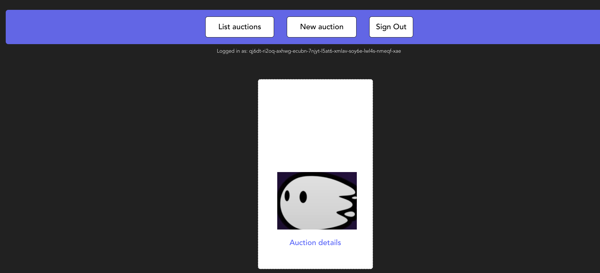
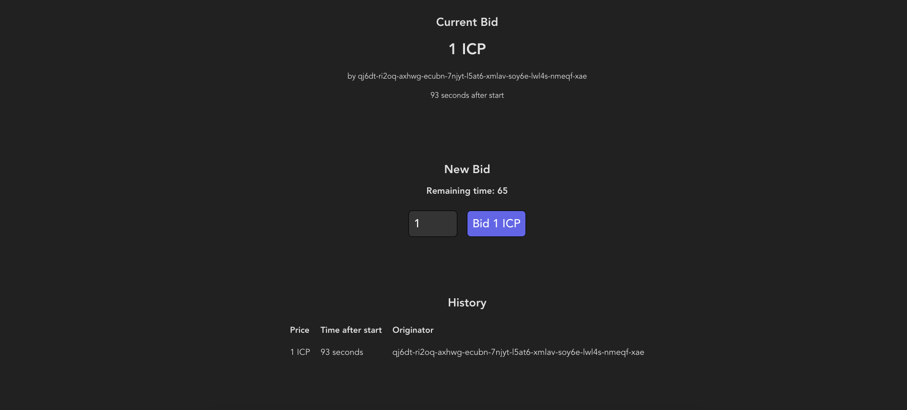

# 5.5 Creating an auction dapp

## Overview

Until this point in the developer journey series, each tutorial has focused on a specific use-case or feature of ICP. To wrap up the series, this tutorial will showcase how to create a general purpose dapp that provides a real-world use-case. In this tutorial, you'll create the foundation for a simple auction dapp. 

In this tutorial, you'll create a simple auction dapp that provides functions such as:

- Opening and viewing auctions.

- Bidding on auctions within a defined deadline.

- Logging into the dapp with Internet Identity. 

## How does an auction work?

To create an auction, an item needs to be put up for sale. Once that item is for sale, potential buyers can place bids on how much they'd like to pay for the item. Usually, auctions last a few minutes or hours, providing buyers the opportunity to out-bid one another. The buyer with the highest bid when the auction ends receives the item.

Auctions are traditionally used for selling items such as:

- Real estate properties.

- Automotive sales.

- Overstock products.

- Storage units. 

- Estate sales.

Auctions are also popularly used for charity events to raise money for an organization. 

## Creating an auction dapp

By creating an auction on a decentralized platform such as ICP, there is an immutable record of the users who bid on the item and who purchased the item. This allows for verifiable records for sales of high-value items or digital assets such as NFTs. 

### Prerequisites

Before you start, verify that you have set up your developer environment according to the instructions in [0.3 Developer environment setup](../level-0/03-dev-env.md).

### Cloning the `auction` example

To get started, open a new terminal window, navigate into your working directory (`developer_journey`), then use the following commands to clone `auction` example repo:

```bash
git clone https://github.com/luc-blaeser/auction
cd auction
```

### Reviewing the project's files

This project was originally developed for a Motoko workshop at the [KTH summer school](https://cysep.conf.kth.se/). To provide additional context for the students in that workshop, this project's repo includes supplemental resources for learning Motoko. This tutorial will not review those resources, but it is recommended that you review them for additional context. 

In this project's directory, you will see the following files and subdirectories:

```bash
├── Installation.md
├── Motoko_Tutorial.pdf
├── README.md
├── Structure.md
├── dfx.json
├── index.html
├── package-lock.json
├── package.json
├── src
│   ├── backend
│   │   └── AuctionServer.mo
│   └── frontend
│       ├── App.scss
│       ├── App.tsx
│       ├── AuctionDetail.scss
│       ├── AuctionDetail.tsx
│       ├── AuctionForm.scss
│       ├── AuctionForm.tsx
│       ├── AuctionList.scss
│       ├── AuctionList.tsx
│       ├── Navigation.scss
│       ├── Navigation.tsx
│       ├── assets
│       │   └── motoko.png
│       ├── common.ts
│       ├── index.scss
│       ├── main.tsx
│       └── vite-env.d.ts
├── tsconfig.json
├── tsconfig.node.json
└── vite.config.ts
```

These project files are used for the following purposes:

- `Installation.md`, `Motoko_tutorial.pdf`, and `Structure.md`: Supplemental learning resources. 

- `src/backend/AuctionServer.mo`: The backend canister's source code.

- `src/frontend`: The frontend assets for the UI of the dapp. 

- `dfx.json`: The project's configuration file.

This project contains three canisters, as seen in the `dfx.json` file:

```json
{
    "canisters": {
        "backend": {
            "type": "motoko",
            "main": "src/backend/AuctionServer.mo"
        },
        "frontend": {
            "dependencies": [
                "backend"
            ],
            "type": "assets",
            "frontend": {
                "entrypoint": "dist/index.html"
            },
            "source": [
                "dist/"
            ]
        },
        "internet_identity": {
            "type": "custom",
            "candid": "https://github.com/dfinity/internet-identity/releases/latest/download/internet_identity.did",
            "wasm": "https://github.com/dfinity/internet-identity/releases/latest/download/internet_identity_dev.wasm.gz",
            "remote": {
                "id": {
                    "ic": "rdmx6-jaaaa-aaaaa-aaadq-cai"
                }
            },
            "frontend": {}
        }
    }
}
```

- `backend`: The auction's backend canister, written in Motoko.

- `frontend`: The auction's frontend canister, implemented using Typescript and React.

- `internet_identity`: This canister is a local instance of the Internet Identity canister, and is built from the Candid and Wasm files from the latest DFINITY Internet Identity release. 

### Creating the backend canister

Next, open the `src/backend/AuctionServer.mo` file. This file will contain a template that includes placeholder functions; to provide full functionality in your dapp, you will need to replace the template code with functioning code. To do that, start by removing the existing code in the `src/backend/AuctionServer.mo` file and insert the following code that has been annotated to explain the code's logic:

```motoko
/// Import the necessary libraries:

import Principal "mo:base/Principal";
import Timer "mo:base/Timer";
import Debug "mo:base/Debug";
import List "mo:base/List";


/// Next, define the actor fort he auction platform:

actor {
  /// Define an item for the auction: 
  type Item = {
    /// Define a title for the auction:
    title : Text;
    /// Define a description for the auction:
    description : Text;
    /// Define an image used as an icon for the auction:
    image : Blob;
  };

  /// Define the auction's bid:
  type Bid = {
    /// Define the price for the bid using ICP as the currency:
    price : Nat;
    /// Define the time the bid was placed, measured as the time remaining in the auction: 
    time : Nat;
    /// Define the authenticated user ID of the bid:
    originator : Principal.Principal;
  };

  /// Define an auction ID to uniquely identify the auction:
  type AuctionId = Nat;

  /// Define an auction overview:
  type AuctionOverview = {
    id : AuctionId;
    /// Define the auction sold at the item:
    item : Item;
  };

  /// Define the details of the auction:
  type AuctionDetails = {
    /// Item sold in the auction:
    item : Item;
    /// Bids submitted in the auction:
    bidHistory : [Bid];
    /// Time remaining in the auction:
    /// the auction winner.
    remainingTime : Nat;
  };

  /// Define an internal, non-shared type for storing info about the auction:
  type Auction = {
    id : AuctionId;
    item : Item;
    var bidHistory : List.List<Bid>;
    var remainingTime : Nat;
  };

  /// Create a stable variable to store the auctions:
  stable var auctions = List.nil<Auction>();
  /// Define a counter for generating new auction IDs.
  stable var idCounter = 0;

  /// Define a timer that occurs every second, used to define the time remaining in the open auction:
  func tick() : async () {
    for (auction in List.toIter(auctions)) {
      if (auction.remainingTime > 0) {
        auction.remainingTime -= 1;
      };
    };
  };

  /// Install a timer: 
  let timer = Timer.recurringTimer(#seconds 1, tick);

  /// Define a function to generating a new auction:
  func newAuctionId() : AuctionId {
    let id = idCounter;
    idCounter += 1;
    id;
  };

  /// Define a function to register a new auction that is open for the defined duration:
  public func newAuction(item : Item, duration : Nat) : async () {
    let id = newAuctionId();
    let bidHistory = List.nil<Bid>();
    let newAuction = { id; item; var bidHistory; var remainingTime = duration };
    auctions := List.push(newAuction, auctions);
  };

  /// Define a function to retrieve all auctions: 
  /// Specific auctions can be separately retrieved by `getAuctionDetail`:
  public query func getOverviewList() : async [AuctionOverview] {
    func getOverview(auction : Auction) : AuctionOverview = {
      id = auction.id;
      item = auction.item;
    };
    let overviewList = List.map<Auction, AuctionOverview>(auctions, getOverview);
    List.toArray(List.reverse(overviewList));
  };

  /// Define an internal helper function to retrieve auctions by ID: 
  func findAuction(auctionId : AuctionId) : Auction {
    let result = List.find<Auction>(auctions, func auction = auction.id == auctionId);
    switch (result) {
      case null Debug.trap("Inexistent id");
      case (?auction) auction;
    };
  };

  /// Define a function to retrieve detailed info about an auction using its ID: 
  public query func getAuctionDetails(auctionId : AuctionId) : async AuctionDetails {
    let auction = findAuction(auctionId);
    let bidHistory = List.toArray(List.reverse(auction.bidHistory));
    { item = auction.item; bidHistory; remainingTime = auction.remainingTime };
  };

  /// Define an internal helper function to retrieve the minimum price for an auction's next bid; the next bid must be one unit of currency larger than the last bid: 
  func minimumPrice(auction : Auction) : Nat {
    switch (auction.bidHistory) {
      case null 1;
      case (?(lastBid, _)) lastBid.price + 1;
    };
  };

  /// Make a new bid for a specific auction specified by the ID:
  /// Checks that:
  /// * The user (`message.caller`) is authenticated.
  /// * The price is valid, higher than the last bid, if existing.
  /// * The auction is still open.
  /// If valid, the bid is appended to the bid history.
  /// Otherwise, traps with an error.
  public shared (message) func makeBid(auctionId : AuctionId, price : Nat) : async () {
    let originator = message.caller;
    if (Principal.isAnonymous(originator)) {
      Debug.trap("Anonymous caller");
    };
    let auction = findAuction(auctionId);
    if (price < minimumPrice(auction)) {
      Debug.trap("Price too low");
    };
    let time = auction.remainingTime;
    if (time == 0) {
      Debug.trap("Auction closed");
    };
    let newBid = { price; time; originator };
    auction.bidHistory := List.push(newBid, auction.bidHistory);
  };
};
```

### Starting a local replica

Before you can deploy the project's canisters, you'll need to assure that a local replica is running with the command:

```bash
dfx start --clean --background
```

### Deploying the project's canisters

Now it's time to deploy the project's canisters with the command:

```bash
npm run setup
```

In the background, this command runs the commands `npm i && dfx canister create --all && dfx generate backend && dfx deploy`.

Then, you can start the local development server with the command:

```bash
npm start
```

This command will return the local URL that the dapp is running at; by default, this will be `http://localhost:3000/`. 

### Using the dapp

It's time to use the auction dapp to create and bid on an auction! To get started, open the local URL that was returned by the `npm start` command, such as `http://localhost:3000`. You'll see the frontend of the dapp:


Then, select the 'Sign in' button to authenticate with a local Internet Identity. Need a reminder on how to create an Internet Identity? Review the [3.5 Identities and authentication](../level-3/3.5-identities-and-auth.md) level of the developer journey. Once authenticated, your II principal will be shown in the dapp's UI:


Then, select 'Start New Auction' to create a new auction.


Give your auction a name, description, image, and set the amount of seconds the auction should last:


Then select 'Create new auction'. The auction will now be listed under 'List auctions'. You can view the auction's details by selecting 'Auction details' under the auction's image:



From the auction details screen, you can place a bid on the auction under 'New bid'. Enter the amount you'd like to bid, then select 'Bid ICP'. 


Once your bid is placed, the window will show the current bid and show the II principal that placed the bid, plus the time in the auction when it was placed. 


If you scroll down, you will see the option to place another bid, followed by the bidding history so far:




## Need help?

Did you get stuck somewhere in this tutorial, or feel like you need additional help understanding some of the concepts? The ICP community has several resources available for developers, like working groups and bootcamps, along with our Discord community, forum, and events such as hackathons. Here are a few to check out:

- [Developer Discord community](https://discord.com/invite/cA7y6ezyE2), which is a large chatroom for ICP developers to ask questions, get help, or chat with other developers asynchronously via text chat. 

- [Developer journey forum discussion](https://forum.dfinity.org/t/developer-journey-feedback-and-discussion/23893).

- [Developer tooling working group](https://www.google.com/calendar/event?eid=MHY0cjBubmlnYXY1cTkzZzVzcmozb3ZjZm5fMjAyMzEwMDVUMTcwMDAwWiBjX2Nnb2VxOTE3cnBlYXA3dnNlM2lzMWhsMzEwQGc&ctz=Europe/Zurich).

- [Motoko Bootcamp - The DAO Adventure](https://github.com/motoko-bootcamp/dao-adventure) - Discover the Motoko language in this 7 day adventure and learn to build a DAO on the Internet Computer.

- [Motoko Bootcamp - Discord community](https://discord.gg/YbksCUxdzk) - A community for and by Motoko developers to ask for advice, showcase projects and participate in collaborative events.

- [Motoko developer working group](https://www.google.com/calendar/event?eid=ZWVnb2luaHU0ZjduMTNpZHI3MWJkcWVwNWdfMjAyMzEwMTJUMTUwMDAwWiBjX2Nnb2VxOTE3cnBlYXA3dnNlM2lzMWhsMzEwQGc&ctz=Europe/Zurich).

- [Upcoming events and conferences](https://dfinity.org/events-and-news/).

- [Upcoming hackathons](https://dfinity.org/hackathons/).

- [Weekly developer office hours](https://discord.gg/4a7SZzRk?event=1164114241893187655) to ask questions, get clarification, and chat with other developers live via voice chat. This is hosted on our [developer Discord](https://discord.com/invite/cA7y6ezyE2) group.

- Submit your feedback to the [ICP Developer feedback board](http://dx.internetcomputer.org).

## Next steps

- [5.6 Next steps](/docs/current/tutorials/developer-journey/level-5/5.6-next-steps)