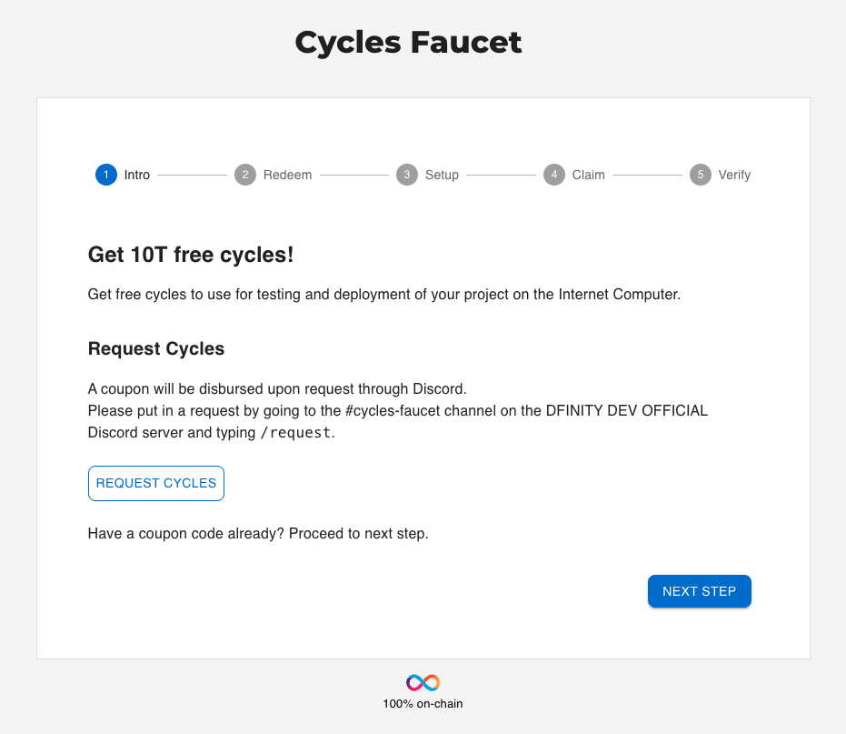
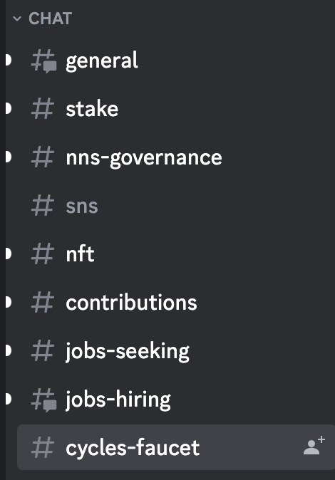

# 7: Obtaining cycles and deploying your dapp to the mainnet
 
## Overview

Cycles are used to measure the resources, such as memory, storage, and compute power, that are used by a canister. When a canister is deployed on the mainnet, cycles are 'charged' for every action that a canister performs. 

To obtain cycles, the Internet Computer Protocol's utility token, ICP, can be converted into cycles and transferred into a canister to be used to pay for that canister's consumed resources. Cycles have a fixed price in XDR in order to make canister costs predictable and independent of the price of ICP. One trillion cycles always correspond to one XDR.

Since cycles are not a currency and are only used to pay for a canister's consumed resources, developers manage the distribution of cycles through a special canister called a cycles wallet. When a canister needs to use cycles, the canister's operations are executed using the cycles wallet's principal. 

## Acquiring cycles using a cycles coupon

For new developers, a free cycles coupon can be obtained and redeemed for 10T free cycles that can be used to get started with dapp deployment. This coupon is good for new developers since it doesn't require that you transfer ICP tokens into cycles, and doesn't require a purchase of tokens to get started.

To obtain this coupon, first, navigate to the website https://faucet.dfinity.org. To obtain a coupon code to use the cycles faucet, you need to put in a written request for the coupon via the DFINITY official developer Discord server.

Click on the `REQUEST CYCLES` button on the faucet web page to join the Discord server.



Once inside the Discord server, navigate into the `#cycles-faucet` channel. 



In this channel, execute the following slash command:

```
/request
```

This command will call the IC Cycles Faucet Bot. This bot will send you a survey that will need to be filled out and submitted. Once the survey has been completed, our team will review your submission. If accepted, the faucet bot will send you a private message with a coupon code.

:::info
Please ensure that your Discord settings are set to allow direct messages from other users. If you do not have this setting enabled, you will not receive a direct message from the faucet bot.
:::

Once you have your coupon code, head back to the <https://faucet.dfinity.org> webpage. 

Now, click **NEXT STEP** to continue. Once you have a coupon code, enter your coupon code within the faucet UI.


Click **NEXT STEP** to continue.

Return to your terminal window. If you closed the window in the process, run the following commands to start `dfx` and use your identity. Replace `MyIdentity` with the name of your developer identity:

```sh
dfx start --background
dfx identity use MyIdentity
```

Then, redeem your coupon with the command, replacing **COUPON_CODE** with the cycles coupon code sent to you by the DFINITY faucet bot:

```sh
dfx wallet --network ic redeem-faucet-coupon COUPON_CODE
```

Verify your cycles balance with the command:

```sh
dfx wallet --network ic balance
```

This should return an output showing 10T cycles in your wallet. To get the canister identifier of your new cycles wallet, run the command:

```sh
dfx identity --network ic get-wallet
```

## Converting ICP tokens to cycles

If you've already redeemed a cycles coupon in the past, you can convert ICP tokens into cycles. Before you can convert ICP tokens into cycles, first you need to obtain ICP tokens. ICP tokens can be purchased through a crypto exchange, or they can be received through other activities such as participating in the NNS governance and receiving grants from the DFINITY foundation.

To get your account ID so you know where to send your ICP tokens, run the command:

```
dfx ledger account-id
```

Once you have sent some ICP to this account ID, you can verify that they were received by checking the balance with the command:

```
dfx ledger --network ic balance
```

After you have your ICP tokens ready, you will need to create a cycles wallet if you haven't already. To check and see if your identity already has a cycles wallet on the mainnet, you can use the following command to retrieve the current wallet addresses for your identity:

```
dfx wallet --network ic addresses
```

If your identity has a cycles wallet already, it will be returned in the output:

```
Id: lsa7b-dlc2s-vmdhm-skjw6-gv2p7-v7kjz-yppyo-mvwmg-ju6fc-k2kpm-dqe, Kind: Unknown, Role: Controller, Name: No name set.
```

Creating a new cycles wallet will require your identity principal, which you can obtain by running the command:

```
dfx identity get-principal
```

Then, to create a cycles wallet, run the following command, replacing the `PRINCIPAL_ID` with your identity's principal value that was returned from the `dfx identity get-principal` command, then replace `ICP_TOKENS` with the amount of tokens you'd like to convert into cycles:

```
dfx ledger --network ic create-canister <PRINCIPAL_ID> --amount <ICP_TOKENS>
```

The ID in this output is the address of the canister where your wallet will live. Now that your cycles wallet canister has been created, you need to install the wallet code with the following command, replacing the `CANISTER_ID` with the value you received in the output of the previous command:

```
dfx identity --network ic deploy-wallet <CANISTER_ID>
```

To verify that your wallet is now configured and ready to use, query the balance of the wallet with the following command, which should return your balance in cycles:

```
dfx wallet --network ic balance
```

## Deploying your dapp to the mainnet

Now that you've obtained some cycles and created a cycles wallet, you can deploy your `vite-motoko-react` sample project to the mainnet. 

First, make sure you have an active connection to the mainnet. In your terminal window, run the command:

```
dfx ping ic
```

A successful connection to the mainnet will return an output such as:

```
{
  "certified_height": 57374997  "ic_api_version": "0.18.0"  "impl_hash": "d5896681ceac74c83c9473654de75214d5079193294ade3775e89a81270fd0cf"  "impl_version": "f8f59f896499f2fef394d8321116f83351c59aa8"  "replica_health_status": "healthy"  "root_key": [48, 129, 130, 48, 29, 6, 13, 43, 6, 1, 4, 1, 130, 220, 124, 5, 3, 1, 2, 1, 6, 12, 43, 6, 1, 4, 1, 130, 220, 124, 5, 3, 2, 1, 3, 97, 0, 129, 76, 14, 110, 199, 31, 171, 88, 59, 8, 189, 129, 55, 60, 37, 92, 60, 55, 27, 46, 132, 134, 60, 152, 164, 241, 224, 139, 116, 35, 93, 20, 251, 93, 156, 12, 213, 70, 217, 104, 95, 145, 58, 12, 11, 44, 197, 52, 21, 131, 191, 75, 67, 146, 228, 103, 219, 150, 214, 91, 155, 180, 203, 113, 113, 18, 248, 71, 46, 13, 90, 77, 20, 80, 95, 253, 116, 132, 176, 18, 145, 9, 28, 95, 135, 185, 136, 131, 70, 63, 152, 9, 26, 11, 170, 174]
}
```

Now, you can deploy your dapp to the mainnet by running the following command:

```
dfx deploy --network ic
```

In this command, the `--network` flag specifies which network the dapp should be deployed on. Other options for this flag are `--network local` and `--network playground`. Using the flag `--network ic` is required to deploy your dapp on the mainnet. If this flag is not included, your dapp will only be deployed locally by default.

:::caution
If you manually converted ICP tokens into cycles, and your cycles wallet doesn't contain enough cycles to complete this deployment, you can add more cycles to your wallet with a command such as:

```
dfx ledger top-up 5o6tz-saaaa-aaaaa-qaacq-cai --network ic --amount 1.005
```

This command converts an additional 1.005 ICP tokens to cycles for the 5o6tz-saaaa-aaaaa-qaacq-cai cycles wallet identifier.
:::

Now, let's use your dapp! To access the dapp's frontend, first you need to get the canister's URL. To get this, run the command:

```
dfx canister id frontend --network ic
```

This command will return the canister's URL, which should look like this:

```
https://5h5yf-eiaaa-aaaaa-qaada-cai.icp0.io
```

If you open this URL in your web browser, you will see the sample dapp frontend that you saw when you deployed it locally. The only difference is that now your dapp is hosted 100% on-chain, does not rely on your local execution environment to keep running, and you can send this URL to anyone in the world to view your dapp!

## Next steps

- [8: Managing canisters](8-managing-canisters.md).